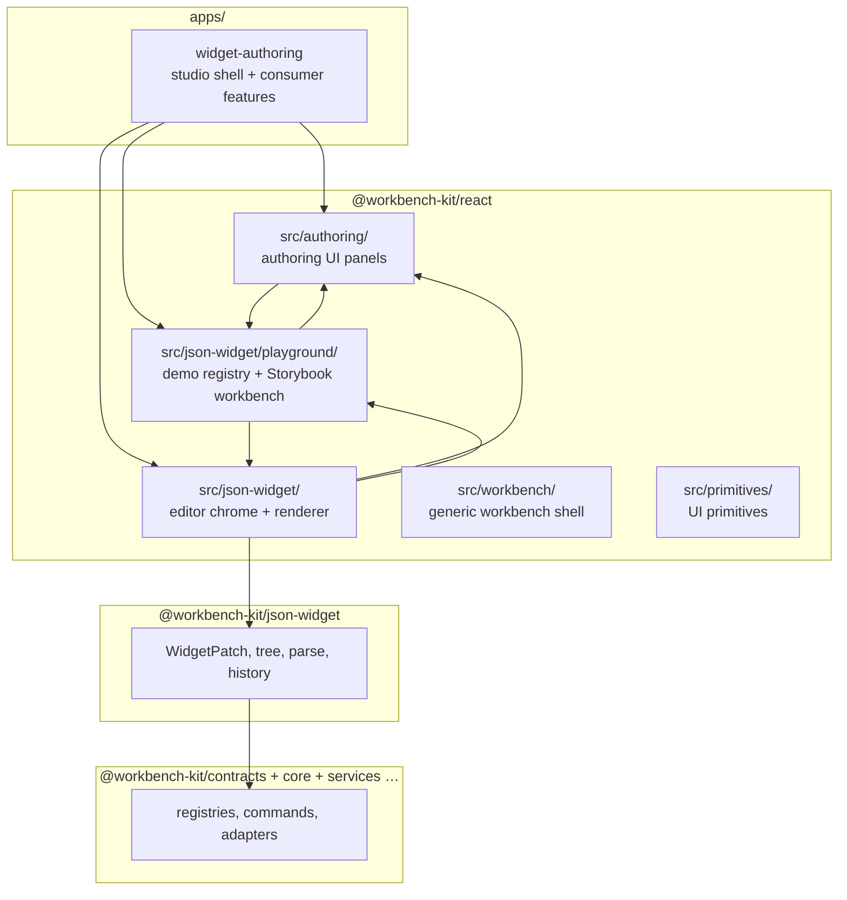

# Directory Structure — Widget Authoring Monorepo

Last updated: 2026-06-08

Companion: [FOUNDATION.md](./FOUNDATION.md), [kit-design-principles.md](./kit-design-principles.md)

This document describes **where code lives** and **what may import what**. It reflects the surgical refactor direction: kit stays domain-neutral; consumers own templates, assets, and chat.

---

## Package map



---

## Layer boundaries

| Layer           | Path                                         | Owns                                                                                                               | Must not own                                                          |
| --------------- | -------------------------------------------- | ------------------------------------------------------------------------------------------------------------------ | --------------------------------------------------------------------- |
| Headless kit    | `packages/json-widget/src/`                  | Patch algebra, tree ops, parse/format, history                                                                     | React, assets UI, templates, chat                                     |
| Editor chrome   | `packages/react/src/json-widget/`            | `JsonWidgetEditor`, preview canvas, tree panel, generic renderer, sync hooks                                       | Domain widgets, asset storage, chat logic                             |
| Authoring UI    | `packages/react/src/authoring/`              | Side panels, palette, inspector rows, drop MIME, canvas presets, snap guides                                       | Playground demo templates, consumer asset DB                          |
| Playground demo | `packages/react/src/json-widget/playground/` | MVP widget registry, insert/ops helpers, `WidgetAuthoringWorkbench` (Storybook + app compose), playground renderer | Production app routes, template gallery, TilePaper-specific templates |
| Consumer app    | `apps/widget-authoring/src/features/`        | Routes, gallery, asset library, chat panel, document persistence                                                   | Generic patch logic, shell layout internals                           |

---

## `packages/` layout

| Package                                      | Role                                                            |
| -------------------------------------------- | --------------------------------------------------------------- |
| `contracts`                                  | Open registries, resource URIs, plugin contracts                |
| `core`                                       | Commands, context keys, when-clauses                            |
| `json-widget`                                | Headless widget document model                                  |
| `react`                                      | React UI: workbench shell, json-widget editor, authoring panels |
| `services`                                   | Save/chat/patch orchestration                                   |
| `runtime`, `workspace`, `adapters`, `tokens` | Host runtime, workspace file model, adapters                    |
| `vscode-host`, `vscode-extension`            | VS Code host track (deferred primary)                           |

---

## `packages/react/src/json-widget/` (editor chrome)

Stays at the **json-widget root** — kit-level editor surface:

| Area          | Files / folders                                                                                                                   |
| ------------- | --------------------------------------------------------------------------------------------------------------------------------- |
| Editor shell  | `JsonWidgetEditor.tsx`, `JsonCodeEditorPane.tsx`, `useJsonWidgetEditorSync.ts`                                                    |
| Preview       | `JsonWidgetPreview.tsx`, `JsonWidgetPreviewCanvas.tsx`, `JsonWidgetCanvas.tsx`, `usePreviewViewport.ts`, `PreviewZoomToolbar.tsx` |
| Panels        | `WidgetEditorPanels.tsx` (inspector), `tree-panel/`                                                                               |
| Renderer      | `renderer/` — generic `WidgetRenderer` + builtins                                                                                 |
| Stories/tests | `*.stories.tsx`, `*.test.tsx` at root                                                                                             |

**Moved out** (see below): `authoring/`, playground flat files, `playground-renderer/`.

---

## `packages/react/src/authoring/` (authoring UI)

Feature-based authoring panels extracted from `json-widget/authoring/`:

```
authoring/
  AuthoringSidebarLayout.tsx    # left/right tab shell
  WidgetEditorSidePanel.tsx     # tabbed side panel chrome
  ComponentPalettePanel.tsx     # add-widgets palette
  CanvasEmptyState.tsx
  InspectorAssetPickerRow.tsx   # asset picker row (consumer supplies assets)
  authoring-sidebar.ts          # panel placement contract
  authoring-drop.ts             # drag/drop MIME helpers
  authoring-shortcuts.ts
  canvas-presets.ts
  inspector-mode.ts
  snap-guides.ts
  widget-type-icons.ts
  index.ts                      # public barrel
```

**Import:** `@workbench-kit/react/authoring` (canonical) or re-exports from `@workbench-kit/react/json-widget` (stable).

---

## `packages/react/src/json-widget/playground/` (demo / Storybook)

Playground-specific code — demo registry, insert helpers, interactive workbench:

```
playground/
  demo-registry.ts              # was demo-playground-registry.ts
  playground-ops.ts
  playground-insert.ts
  PlaygroundPlacementSections.tsx
  WidgetAuthoringWorkbench.tsx  # Storybook + app workbench wrapper
  renderer/
    PlaygroundWidgetRenderer.tsx
    PlaygroundEditorWidgetWrapper.tsx
    PlaygroundPreviewContext.tsx
  index.ts
```

**Import:** `@workbench-kit/react/json-widget/playground` (canonical) or re-exports from `@workbench-kit/react/json-widget` (stable).

---

## `apps/widget-authoring/src/features/` (consumer)

Feature folders — **reference pattern** for consumer-owned policy:

| Feature   | Path                  | Responsibility                                                      |
| --------- | --------------------- | ------------------------------------------------------------------- |
| Templates | `features/templates/` | `TemplateGallery`, template-first routing                           |
| Authoring | `features/authoring/` | `AuthoringStudioPage`, `AuthoringStudioWorkbench`, document storage |
| Assets    | `features/assets/`    | Upload, IndexedDB storage, `AssetLibraryPanel`, drag-to-canvas      |
| Chat      | `features/chat/`      | `AuthoringChatPanel` (right rail)                                   |

`AuthoringStudioWorkbench` composes kit `WidgetAuthoringWorkbench` with consumer panels (`AssetLibraryPanel`, `AuthoringChatPanel`).

---

## Public API / import paths (slim kit v2)

See [KIT_SURFACE.md](./KIT_SURFACE.md) for the full consumer map.

| Need                    | Canonical import                              | Notes                                |
| ----------------------- | --------------------------------------------- | ------------------------------------ |
| Headless engine         | `@workbench-kit/json-widget`                  | **studio-engine** primary dep        |
| Widget contracts        | `@workbench-kit/contracts`                    | Registry / schema types              |
| Editor chrome           | `@workbench-kit/react/json-widget`            | Slim barrel — editor + preview only  |
| Authoring panels        | `@workbench-kit/react/authoring`              | widget-authoring legacy              |
| Playground demo         | `@workbench-kit/react/json-widget/playground` | Storybook + widget-authoring only    |
| Workbench shell & forms | `@workbench-kit/react/workbench`              | studio-engine shell migration target |

---

## Migration notes (2026-06-08)

### What moved

| From                                                    | To                                        |
| ------------------------------------------------------- | ----------------------------------------- |
| `json-widget/authoring/*`                               | `react/src/authoring/*`                   |
| `json-widget/demo-playground-registry.ts`               | `json-widget/playground/demo-registry.ts` |
| `json-widget/playground-ops.ts`, `playground-insert.ts` | `json-widget/playground/`                 |
| `json-widget/PlaygroundPlacementSections.tsx`           | `json-widget/playground/`                 |
| `json-widget/WidgetAuthoringWorkbench.tsx`              | `json-widget/playground/`                 |
| `json-widget/playground-renderer/*`                     | `json-widget/playground/renderer/*`       |
| `json-widget/PlaygroundInteractive.stories.tsx`         | `json-widget/playground/`                 |

### Internal import updates

- Kit editor files import authoring via `../authoring/…`
- Playground files import authoring via `../../authoring/…`
- Authoring files that need demo templates import `../json-widget/playground/demo-registry.js`

### Slim barrel (2026-06-08, v2)

- Removed authoring + playground re-exports from `@workbench-kit/react/json-widget` index
- widget-authoring updated to import playground from `/json-widget/playground` and authoring from `/authoring`

### Not moved (deferred)

- `WidgetInspectorPanel` placement sections still live in `json-widget/WidgetEditorPanels.tsx` (uses playground placement UI — acceptable coupling for now)
- Headless `packages/json-widget` unchanged (surface documented in KIT_SURFACE.md)
- Consumer `features/*` already feature-based — no move required

### Verification

```bash
pnpm --filter @workbench-kit/react typecheck
pnpm --filter @workbench-kit/widget-authoring typecheck
pnpm exec vitest run packages/react
pnpm lint
```

---

## Slim kit policy v2 (2026-06-08)

- **studio-engine** is the canonical generic UI engine; links `contracts` + `json-widget` (+ `react/workbench` for shell/forms). **tilepaper-app** (future) adds product branding.
- **widget-authoring** is a legacy kit-composed prototype (`apps/widget-authoring/README.md`).
- `@workbench-kit/react/json-widget` barrel slimmed: no authoring/playground re-exports.
- Kit playground registry: MVP types only (`text`, `box`, `grid`, `stack`, `row`, `column`, `button`, `image`, `tile`, `divider`).
- `vscode-host` / `vscode-extension` retained for monorepo consumers; not required by studio-engine.
- Build-on-install: `contracts`, `json-widget` only (`scripts/build-workspace-packages.mjs`).

## Future targets

1. **`WidgetInspectorPanel` → authoring** — move inspector-specific sections when playground placement is generalized
2. **`WidgetAuthoringWorkbench` → app** — optional move to `apps/widget-authoring` when kit playground is Storybook-only
3. **Barrel per feature in app** — `features/assets/index.ts`, etc., when cross-feature imports grow
