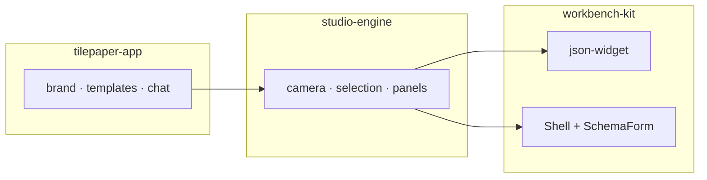
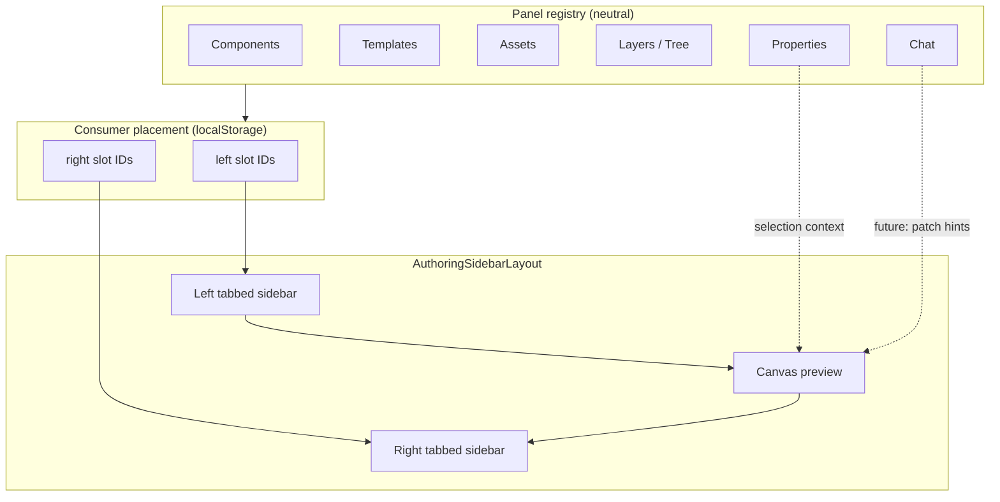
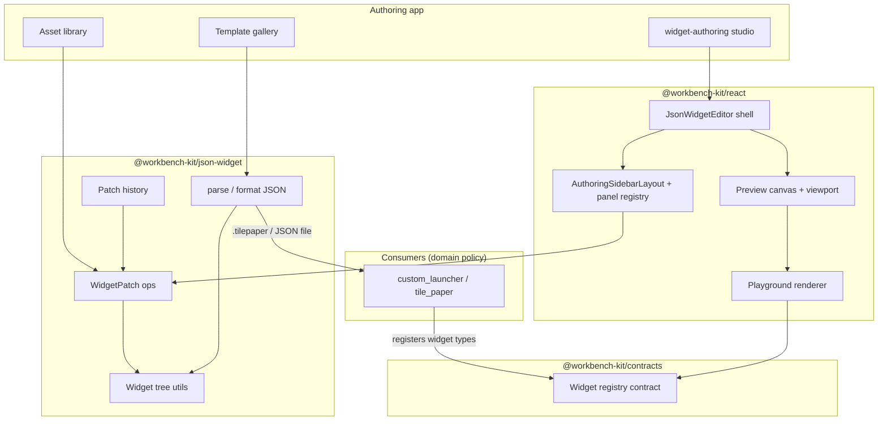

# TilePaper Widget Authoring — Foundation (Clean Restart)

Last updated: 2026-06-08

**Status:** Authoritative direction document. All iteration plans, UI work, and reference study must align with this file first.

> Supersedes tactical priority in older roadmaps until explicitly revised. See [REFERENCE_ROADMAP.md](./REFERENCE_ROADMAP.md) for gap tables and iteration detail _after_ foundation is locked.

---

## 1. Product identity

### One sentence

**TilePaper Widget Authoring** is a beginner-first studio where non-experts compose launcher/tile screens from widgets, assets, and templates — then export portable JSON that runs in TilePaper / custom_launcher without code.

### Who it is for

| Audience         | Need                                                                                      |
| ---------------- | ----------------------------------------------------------------------------------------- |
| **Primary**      | Regular users customizing desktop launchers, tiles, and widget boards (not pro designers) |
| **Secondary**    | Power users who want JSON/code access behind an "Advanced" gate                           |
| **Out of scope** | Figma-grade design systems, multiplayer editing, arbitrary code IDE                       |

### What makes it different

| vs Decent Icons / icon docks                    | vs Figma / Penpot                                      |
| ----------------------------------------------- | ------------------------------------------------------ |
| JSON + live preview, not hand-painted PNG icons | Simpler property UI, template-first onboarding         |
| Reusable widget tree, not one-off art           | No infinite design-system graph in v1                  |
| Shareable `.tilepaper` / JSON files             | Runtime output matters more than pixel-perfect vectors |

### Product combo (locked)

```
Canva UX (onboarding + panels + templates)
  + Penpot document model (tree, components, history)
  + tldraw canvas interaction (camera, select, handles)
  + Excalidraw persistence (versioned JSON file)
  + Webflow runtime direction (JSON → live UI)
  + Figma polish (last — shortcuts, snap, multi-select only where Canva is insufficient)
```

### Kit boundary (non-negotiable)

`@workbench-kit/*` stays **domain-neutral**. "Launchpad", "tile", "Steam", "game" live in consumers (`custom_launcher`, `tile_paper`). The authoring studio configures generic widgets; consumers attach domain meaning.

### Three-layer architecture (2026-06-08)

| Layer             | Repo                      | Contents                                                                                           |
| ----------------- | ------------------------- | -------------------------------------------------------------------------------------------------- |
| **workbench-kit** | `newchobo-ui-package`     | `json-widget` engine, `WorkbenchStandaloneShell`, `SchemaForm`, `StructuredDataForm`, panel chrome |
| **studio-engine** | `studio-engine` (sibling) | UI engine — camera, selection, patch dispatch, feature panels, document store                      |
| **tilepaper-app** | future                    | TilePaper branding, templates, assets, chat, launcher integration                                  |



**Shell & form rule:** Forms and app shell are **workbench-kit** primitives (`@workbench-kit/react/workbench`). studio-engine composes them for inspector and dockable chrome — it does not fork custom shell markup long-term. tilepaper-app adds domain widget schemas and product copy only.

### Slim kit policy v2 (2026-06-08)

**Canonical studio consumer:** `studio-engine` — imports `@workbench-kit/contracts` + `@workbench-kit/json-widget` today; adds `@workbench-kit/react/workbench` for shell/forms migration.

**Product consumer:** `tilepaper-app` (future) — composes studio-engine; owns TilePaper-specific UX.

**Legacy prototype:** `apps/widget-authoring` — kit-composed reference shell; kept for Storybook dogfooding, not new product work.

| Tier                               | Keep in kit                                                                            | Own in studio-engine                         | Own in tilepaper-app                          |
| ---------------------------------- | -------------------------------------------------------------------------------------- | -------------------------------------------- | --------------------------------------------- |
| **Engine**                         | `WidgetPatch`, parse/tree/history, layout math, registry contracts                     | Project file envelope, store, engine modules | `.tilepaper.json` branding, starter templates |
| **Shell & forms**                  | `WorkbenchStandaloneShell`, `WorkbenchSchemaForm`, `StructuredDataForm`, panel regions | Wire panels to store; canvas slot            | Product header copy, gallery                  |
| **React editor chrome (optional)** | `JsonWidgetEditor`, preview canvas, tree panel, builtin renderers                      | Studio canvas, selection chrome              | —                                             |
| **Playground (internal)**          | MVP registry + `WidgetAuthoringWorkbench` under `/json-widget/playground`              | —                                            | Marketing gallery                             |
| **Deferred**                       | `vscode-*`, `core`, `workspace`                                                        | —                                            | VS Code host experiments                      |

Public import map: [KIT_SURFACE.md](./KIT_SURFACE.md). Shell migration: [studio-engine/docs/SHELL_MIGRATION.md](../../../studio-engine/docs/SHELL_MIGRATION.md).

`@workbench-kit/react/json-widget` no longer re-exports authoring or playground — use `/authoring` and `/json-widget/playground` explicitly.

---

## 2. Core principles (max 10)

Each principle is **actionable** — use it to accept or reject a feature in review.

| #   | Principle                              | Decision rule                                                                                                                                                                                                                                              |
| --- | -------------------------------------- | ---------------------------------------------------------------------------------------------------------------------------------------------------------------------------------------------------------------------------------------------------------- |
| 1   | **Beginner first**                     | If a pro designer would love it but a regular user would stall, defer or hide behind Advanced.                                                                                                                                                             |
| 2   | **Symmetric dockable sidebars**        | Left and right rails are **equal slots** — any panel (components, templates, assets, layers, properties, chat) can dock on either side. Kit exposes placement API; consumer persists preference. Sensible defaults: add panels left, inspect + chat right. |
| 3   | **Template before blank**              | Default entry is gallery / preset, not empty canvas. Blank is explicit opt-in.                                                                                                                                                                             |
| 4   | **Widget tree is truth**               | All edits flow through `GenericWidget` + `WidgetPatch`. No parallel shape store (no tldraw document as source of truth).                                                                                                                                   |
| 5   | **Transient canvas, serializable doc** | Drag offsets, hover, marquee live in React refs; only patchable props persist to JSON.                                                                                                                                                                     |
| 6   | **Registry over enum**                 | New widget types register via `createWidgetRegistry`; kit never hard-codes domain widget unions.                                                                                                                                                           |
| 7   | **Undo is a product feature**          | Every user-visible mutation must be reversible before shipping the iteration.                                                                                                                                                                              |
| 8   | **Export equals runtime**              | Saved JSON must render identically in Storybook preview, authoring app, and consumer launcher — no author-only fields without a migration path.                                                                                                            |
| 9   | **Study patterns, don't fork engines** | Copy interaction patterns from tldraw/Figma; do not embed tldraw shapes or Penpot's full CLJS stack.                                                                                                                                                       |
| 10  | **Ship vertical slices**               | One complete loop (pick template → add widget → set property → save → reload) beats many half-finished panels.                                                                                                                                             |

---

## 3. UI/UX reference matrix

Use this table to settle **who wins** when references conflict.

| Reference      | Primary role       | Adopt in v1                                                                                       | Study for                                                 | Explicitly avoid                                                     |
| -------------- | ------------------ | ------------------------------------------------------------------------------------------------- | --------------------------------------------------------- | -------------------------------------------------------------------- |
| **Canva**      | #1 UX north star   | Template landing, dockable panel tabs, upload→place, minimal inspector, size presets, export CTA  | Gallery categories, brand-kit lite, empty-state copy      | Component graph, patch internals, code export                        |
| **Penpot**     | #1 OSS structure   | Layers tree, undo/history model, component/instance mental model, file envelope                   | `history`, `components`, `workspace_viewport`             | Beginner onboarding tone, marketing gallery UX                       |
| **tldraw**     | Canvas interaction | Camera zoom/pan, select/move, resize handles, tool modes (select/hand), history marks on drag end | `Editor` camera, selection chrome, brush/marquee patterns | Shape store as document, template gallery, tldraw SDK as doc engine  |
| **Excalidraw** | Persistence format | Versioned JSON file, schema migration, load/save envelope                                         | `packages/excalidraw` data layer, `.excalidraw` structure | Whiteboard-specific tools (draw, arrow) as product features          |
| **Figma**      | Polish (last)      | Snap guides, keyboard shortcuts (V/H, Del, Ctrl+Z), multi-select polish                           | Alignment, distribution, pro shortcuts                    | Default inspector density, first-run flow, layers-as-only-navigation |
| **Webflow**    | Runtime output     | JSON/widget → rendered UI parity, symbol-like reuse story                                         | Component instance → published page mental model          | Full site builder, CMS, hosting                                      |

### Conflict resolution order

1. **Canva** — layout, onboarding, panel topology, copy tone
2. **Penpot** — data model, tree, components, undo
3. **tldraw** — canvas manipulation feel
4. **Excalidraw** — file on disk
5. **Webflow** — what "publish" means
6. **Figma** — only when 1–3 lack a pattern

### Target shell layout (v1)

```
┌─────────────────────────────────────────────────────────────┐
│  Toolbar: undo/redo · size preset · save/export · theme     │
├──────────┬────────────────────────────────────┬─────────────┤
│  LEFT    │           CANVAS                   │   RIGHT     │
│  (tabs)  │   (preview frame + selection)      │   (tabs)    │
│  default │                                   │   default   │
│  · Layers│                                   │  · Props    │
│  · Widgets│                                  │  · Chat     │
│  · Assets │                                   │             │
└──────────┴────────────────────────────────────┴─────────────┘
```

**Symmetric sidebar contract (VS Code / JetBrains pattern)**

Both rails are **peer dock slots**. Panel types are registered once; placement decides left vs right.

| Concept        | Owner                | Notes                                                                                         |
| -------------- | -------------------- | --------------------------------------------------------------------------------------------- |
| Panel registry | Kit + consumer       | `id`, `label`, `content` — Components, Templates, Assets, Layers, Properties, Chat            |
| Placement      | Consumer (persisted) | `{ left: PanelId[], right: PanelId[] }` — each side renders as tabbed `WidgetEditorSidePanel` |
| Move control   | Kit shell            | Per-panel **Move to left / Move to right** (MVP); future: drag-reorder                        |
| Center         | Kit                  | Canvas preview (+ optional code split)                                                        |
| Chat content   | Consumer app         | `renderRightSidebar` registers `chat` panel; side is user-configurable                        |

**Default placement** (beginner-friendly, overridable):

| Left                       | Right            |
| -------------------------- | ---------------- |
| Layers, Components, Assets | Properties, Chat |

(Templates live on the app gallery route `/`, not in the editor sidebar.)



---

## 4. Open source study paths

Study **by question**, not by cloning repos wholesale.

### Penpot (`github.com/penpot/penpot`)

| Question                                | Where to look                             | Apply here                 |
| --------------------------------------- | ----------------------------------------- | -------------------------- |
| How does undo batch pointer moves?      | `frontend/src/app/main/data/history.cljs` | `widget-patch-history.ts`  |
| How are components/instances modeled?   | `components.cljs`, `variants.cljs`        | Phase 2 component registry |
| How does the layers tree map to shapes? | `workspace_sidebar/layers.cljs`           | `WidgetTreePanel`          |
| How does viewport + snap work?          | `workspace_viewport`, `snap`, `guides`    | Canvas snap guides         |

**Time box:** 2–3 days reading before Iteration 2–4 features; extract patterns into TypeScript, not CLJS.

### tldraw (`github.com/tldraw/tldraw`)

| Question                  | Where to look                                              | Apply here                        |
| ------------------------- | ---------------------------------------------------------- | --------------------------------- |
| Camera / zoom / pan       | `packages/editor/src/lib/editor/Editor.ts`, `camera` store | `usePreviewViewport`              |
| Selection + handles       | `SelectionForeground`, resize sessions                     | `PlaygroundEditorWidgetWrapper`   |
| Marquee / brush select    | `BrushSession`, `select.ts`                                | `JsonWidgetPreviewCanvas` overlay |
| Undo marks on gesture end | `HistoryManager`, `markHistoryStoppingPoint`               | batch drag into single patch      |

**Time box:** 1–2 days per canvas feature; **never** replace `GenericWidget` with tldraw shapes.

### Excalidraw (`github.com/excalidraw/excalidraw`)

| Question                        | Where to look                                    | Apply here                                |
| ------------------------------- | ------------------------------------------------ | ----------------------------------------- |
| File envelope + version         | `packages/excalidraw/data/json.ts`, `restore.ts` | `formatWidgetJson` + schema version field |
| Serializable vs ephemeral state | element sync vs local appState                   | React refs for drag; patches for layout   |
| Migration on load               | `migrate.ts`                                     | `parseWidgetJson` version bump hook       |

**Time box:** 1 day for persistence iteration; define `.tilepaper-authoring.json` or reuse generic envelope in consumer.

### Canva / Webflow / Figma (closed source)

No repo — use **screenshots + heuristic specs** documented in [REFERENCE_ROADMAP.md](./REFERENCE_ROADMAP.md) (Canva patterns table). Validate with 30-minute usability walkthroughs, not pixel matching.

### Recommended study order

1. Canva (panel layout + template flow) — **before any UI refactor**
2. Excalidraw JSON envelope — **before persistence hardening**
3. Penpot history + tree — **with undo/tree work**
4. tldraw selection/camera — **with canvas iteration**
5. Penpot components — **Phase 2 only**
6. Figma shortcuts/snap — **after Canva shell is stable**
7. Webflow runtime — **Phase 6 / export bridge**

---

## 5. MVP v1 scope

**MVP v1 definition:** A single user can open the studio, pick a template, add/move/resize widgets, upload and place images, edit essential properties, undo/redo, save JSON, reload, and see the same result in preview — without reading docs.

### IN SCOPE (v1)

| Area          | Deliverable                                                                                               | Done?              |
| ------------- | --------------------------------------------------------------------------------------------------------- | ------------------ |
| Document core | `GenericWidget` tree, `WidgetPatch`, parse/format                                                         | Yes (keep)         |
| Canvas        | Single + multi select, move, resize (grid + basic freeform), zoom/pan                                     | Partial            |
| Panels        | Symmetric dockable sidebars; default left = add + layers, right = properties + chat; user can move panels | Partial (scaffold) |
| Assets        | Upload image, drag to canvas, pick in inspector                                                           | Partial            |
| History       | Undo/redo on all patch mutations                                                                          | Partial            |
| Templates     | Gallery as default route; clone template to new doc                                                       | Partial            |
| Persistence   | Local save/load with versioned JSON envelope                                                              | Partial            |
| Presets       | Phone / tablet / desktop frame sizes                                                                      | Yes                |
| Advanced      | Raw JSON editor behind collapsed "Advanced"                                                               | Yes                |
| Verification  | typecheck, lint, test, Storybook + `dev:widget-authoring` smoke                                           | Ongoing            |

### OUT OF SCOPE (v1) — explicit

| Feature                                   | Why deferred                                                          | Earliest phase        |
| ----------------------------------------- | --------------------------------------------------------------------- | --------------------- |
| Real-time collaboration / presence        | Requires stable file format + OT/CRDT                                 | Post v1               |
| tldraw SDK as document engine             | Breaks runtime parity with widget tree                                | Never (patterns only) |
| Figma-grade design tokens / variables     | Overwhelms beginners                                                  | v2+                   |
| Published component libraries + variants  | Needs Penpot-style component file                                     | Phase 2               |
| SVG symbol library / icon font editor     | Asset scope creep                                                     | v2                    |
| Node-graph authoring                      | Exploration only ([future-capabilities.md](./future-capabilities.md)) | Not scheduled         |
| VS Code extension as primary host         | Standalone app first                                                  | Parallel track        |
| Code export (React/CSS)                   | Webflow bridge                                                        | Phase 6               |
| Brand kit / team libraries                | Canva enterprise patterns                                             | v2+                   |
| Infinite canvas / multi-page docs         | Penpot pages model                                                    | v2                    |
| Plugin marketplace                        | Kit contracts exist; no store in v1                                   | v2+                   |
| Domain widgets (Steam, game tiles) in kit | Consumer responsibility                                               | N/A                   |

---

## 6. Architecture (clean layers)



### Layer rules

| Layer                  | Owns                                                                                                                   | Must not own                                                    |
| ---------------------- | ---------------------------------------------------------------------------------------------------------------------- | --------------------------------------------------------------- |
| `json-widget`          | Patch algebra, tree ops, parse, history                                                                                | React, assets UI, templates                                     |
| `react`                | Editor UI, canvas chrome, renderer, **symmetric sidebar placement API** (`AuthoringSidebarLayout`, `sidebarPlacement`) | Domain widget definitions, chat/AI logic, placement persistence |
| `widget-authoring` app | Routes, gallery, asset storage, export UX, **AuthoringChatPanel**, **sidebar placement localStorage**                  | Generic patch logic, shell layout internals                     |
| Consumer               | Widget type defs, runtime launch, Steam/tiles                                                                          | Authoring shell layout                                          |

---

## 7. Restart execution plan

### Decision: **Surgical refactor** (not greenfield)

| Option                | Verdict    | Rationale                                                                                                                 |
| --------------------- | ---------- | ------------------------------------------------------------------------------------------------------------------------- |
| **Full greenfield**   | Reject     | Throws away proven `WidgetPatch`, registry, tests, and Storybook harness. High risk, 4–6 week rewind.                     |
| **Blind continue**    | Reject     | Current shell is inspect-first / toolbar-template; conflicts with Canva principles.                                       |
| **Surgical refactor** | **Accept** | Keep `packages/json-widget` + renderer; **rebuild authoring shell topology and iteration order** against this foundation. |

### Phase 0 — Lock foundation (this document)

- [x] Publish `FOUNDATION.md`
- [ ] Team sign-off: principles + MVP in/out + refactor choice
- [ ] Freeze new features until Phase 1 shell sketch is approved

### Phase 1 — Shell realignment (1–2 weeks)

1. **Panel topology** — `AuthoringSidebarLayout` with symmetric slots; default left = layers + add panels; default right = properties + chat; **Move to left/right** MVP; placement persisted in `widget-authoring` app.
2. **Template-first route** — `TemplateGallery` as default `/`; editor at `/edit/:id`.
3. **Inspector simplification** — 3–5 fields per widget type; JSON in Advanced accordion (default collapsed).
4. **Delete or hide** inspect-first flows that contradict principle #2.

**Exit criteria:** New user completes template → add image → change text → save → reload without opening Advanced.

### Phase 2 — Trust loop (1 week)

1. Wire undo/redo to every patch entry point (verify no bypass).
2. Keyboard shortcuts (Ctrl+Z/Y, Del, V/H).
3. Versioned JSON envelope on save (Excalidraw pattern).

**Exit criteria:** Phase 1 user story + 20-action undo chain passes manual test.

### Phase 3 — Canvas feel (2 weeks)

1. Multi-select + marquee (tldraw patterns).
2. Snap guides (Figma-lite).
3. Freeform position for `stack` children where needed.
4. Select / hand tool toggle.

**Exit criteria:** Move/resize feels comparable to tldraw on a **fixed frame** (not infinite canvas).

### Phase 4 — Components & export (post-v1)

- Penpot component registry, Webflow runtime bridge — only after Phases 1–3 exit criteria met.
- Track detail in [REFERENCE_ROADMAP.md](./REFERENCE_ROADMAP.md).

### What to delete vs keep

| Keep                                 | Refactor / rebuild                           | Defer                  |
| ------------------------------------ | -------------------------------------------- | ---------------------- |
| `packages/json-widget/*`             | `apps/widget-authoring` routes & layout      | Collaboration          |
| `WidgetPatch` + history              | `WidgetEditorSidePanel` tab order & defaults | tldraw SDK integration |
| `PlaygroundWidgetRenderer`           | `JsonWidgetEditor` panel slots               | Code export            |
| Storybook stories                    | Empty-state → gallery CTA                    | Brand kit              |
| `widget-authoring` asset upload core | Toolbar template buttons → gallery only      |                        |

### Verification gate (every phase)

```bash
pnpm typecheck && pnpm lint && pnpm test
pnpm --filter @workbench-kit/react test
pnpm dev:widget-authoring
```

Manual script: template → add widget → upload → drag → inspect → undo → save → hard refresh → export JSON → open in Storybook preview.

---

## Related docs

- [KIT_SURFACE.md](./KIT_SURFACE.md) — slim kit v2 public import map (studio-engine + shell/forms)
- [DIRECTORY_STRUCTURE.md](./DIRECTORY_STRUCTURE.md) — package/folder map, import boundaries, migration notes
- [REFERENCE_ROADMAP.md](./REFERENCE_ROADMAP.md) — gap table, iteration 2–7 detail
- [kit-design-principles.md](./kit-design-principles.md) — kit neutrality rules
- [reference-implementation-strategy.md](./reference-implementation-strategy.md) — Option C hybrid / TilePaper positioning
- [apps/widget-authoring/ITERATION_LOG.md](../../apps/widget-authoring/ITERATION_LOG.md) — implementation log
