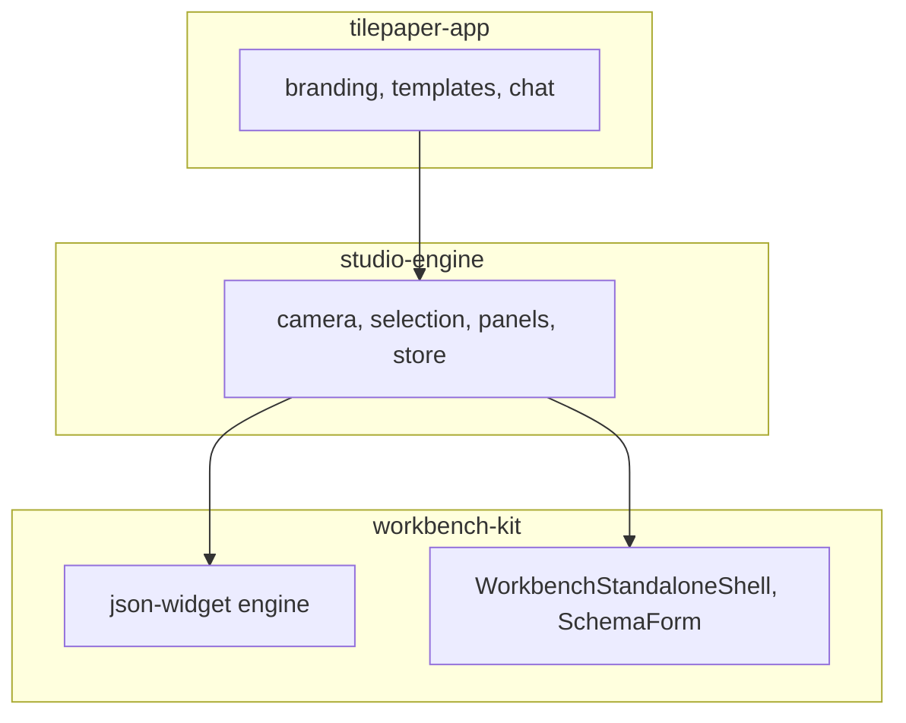

# Workbench Kit — Public Surface (Slim Kit v2)

Last updated: 2026-06-08

Companion: [FOUNDATION.md](./FOUNDATION.md), [DIRECTORY_STRUCTURE.md](./DIRECTORY_STRUCTURE.md)

This document defines **what external apps should import** from `@workbench-kit/*` after the slim-kit refactor. The canonical studio consumer is **studio-engine** (generic UI engine); **tilepaper-app** (future) adds product branding. **apps/widget-authoring** is a legacy kit-composed prototype.

---

## Three-layer split

| Layer             | Repo                  | workbench-kit imports                                                           |
| ----------------- | --------------------- | ------------------------------------------------------------------------------- |
| **workbench-kit** | `newchobo-ui-package` | (this monorepo) — engine, shell, forms                                          |
| **studio-engine** | `studio-engine`       | `contracts`, `json-widget` today; `react/workbench` for shell + inspector forms |
| **tilepaper-app** | future                | composes studio-engine; domain widgets + templates only                         |



**Shell & form ownership (workbench-kit):** `WorkbenchStandaloneShell`, `WorkbenchShell`, `WorkbenchSchemaForm`, `WorkbenchStructuredDataForm`, `WorkbenchPanelRegion`, `WorkbenchSectionedPanel`. studio-engine **consumes** these — it does not reimplement app chrome or schema-driven forms. tilepaper-app adds domain widget schemas only.

---

## Summary

| Tier                               | Packages                                                                    | Who imports                                                  |
| ---------------------------------- | --------------------------------------------------------------------------- | ------------------------------------------------------------ |
| **Engine (required)**              | `@workbench-kit/contracts`, `@workbench-kit/json-widget`                    | studio-engine, tile_paper, custom_launcher (partial)         |
| **Workbench shell & forms**        | `@workbench-kit/react/workbench`, `@workbench-kit/react/workbench/settings` | studio-engine (planned), vue3-chatbot, integrated demos      |
| **React editor chrome (optional)** | `@workbench-kit/react/json-widget`                                          | tile_paper pilots, custom_launcher, legacy widget-authoring  |
| **Authoring panels (legacy)**      | `@workbench-kit/react/authoring`                                            | widget-authoring app only                                    |
| **Playground demo (internal)**     | `@workbench-kit/react/json-widget/playground`                               | widget-authoring, Storybook                                  |
| **VS Code host (deferred)**        | `@workbench-kit/vscode-host`, `@workbench-kit/vscode-extension`             | Extension track; keep in monorepo, not primary for TilePaper |

**Build on install:** only `contracts` and `json-widget` (`pnpm build:workspace`). Other packages are TypeScript source exports.

---

## studio-engine — kit import map

studio-engine owns the **UI engine** (canvas, selection, patch dispatch, panel wiring). Product branding (TilePaper gallery, templates) moves to **tilepaper-app** later.

### Today (engine only)

```json
"@workbench-kit/contracts": "link:../newchobo-ui-package/packages/contracts",
"@workbench-kit/json-widget": "link:../newchobo-ui-package/packages/json-widget"
```

### Planned (shell + forms)

```json
"@workbench-kit/react": "link:../newchobo-ui-package/packages/react"
```

Import paths:

| Need                       | Import                                                                                           |
| -------------------------- | ------------------------------------------------------------------------------------------------ |
| App shell                  | `@workbench-kit/react/workbench` → `WorkbenchStandaloneShell`                                    |
| Inspector / settings forms | `@workbench-kit/react/workbench/settings` → `WorkbenchSchemaForm`, `WorkbenchStructuredDataForm` |
| Panel chrome               | `@workbench-kit/react/workbench` → `WorkbenchPanelRegion`, `WorkbenchSectionedPanel`             |

Migration steps: [studio-engine/docs/SHELL_MIGRATION.md](../../../studio-engine/docs/SHELL_MIGRATION.md).

### Symbols used today (`@workbench-kit/json-widget`)

| Area              | Symbols                                                                                                                                                                                         |
| ----------------- | ----------------------------------------------------------------------------------------------------------------------------------------------------------------------------------------------- |
| Document model    | `GenericWidget`, `WidgetPatch`                                                                                                                                                                  |
| Parse / serialize | `formatWidgetJson`, `parseWidgetJson`                                                                                                                                                           |
| Tree              | `getWidgetAtPath`, `getWidgetChildren`, `getWidgetDisplayLabel`, `collectWidgetNodes`                                                                                                           |
| Selection         | `WidgetPath`, `WidgetSelectionState`, `ROOT_WIDGET_PATH`, `emptyWidgetSelection`, `selectWidgetPath`, `firstSelectedWidgetPath`, `isWidgetPathSelected`, `selectedWidgetPaths`, `widgetPathKey` |
| Patch apply       | `applyWidgetPatchToDocument`, `createJsonWidgetEditorSyncSnapshot`                                                                                                                              |
| History           | `initializeWidgetPatchHistory`, `WidgetPatchHistory`                                                                                                                                            |

### Types from `@workbench-kit/contracts` (via json-widget re-exports)

Use when registering custom widget types: `WidgetRegistryContract`, `WidgetTypeShape`, `WidgetTypeDefinition`, `WidgetJsonSchema`.

Direct `import from '@workbench-kit/contracts'` is optional; json-widget re-exports the widget-registry types.

### Not needed by studio-engine (engine tier)

- `createPlaygroundWidgetJsonSchema`, `PLAYGROUND_WIDGET_JSON_SCHEMA` — kit editor / Storybook only
- `createWidgetRegistry` — use when runtime needs a type registry; studio may add later
- Layout helpers (`computeGridChildRect`, etc.) — studio canvas may adopt when snap/layout hardens
- All `@workbench-kit/react/*` exports

---

## `@workbench-kit/json-widget` — full engine export map

| Group                             | Key exports                                                                                                                       |
| --------------------------------- | --------------------------------------------------------------------------------------------------------------------------------- |
| Parse                             | `formatWidgetJson`, `parseWidgetJson`, `ParsedWidgetJson`                                                                         |
| Tree                              | `GenericWidget`, `getWidgetAtPath`, `getWidgetChildren`, `insertWidgetChildAtPath`, `removeWidgetAtPath`, `updateWidgetAtPath`, … |
| Path                              | `WidgetPath`, `widgetPathKey`, `ROOT_WIDGET_PATH`, …                                                                              |
| Selection                         | `WidgetSelectionState`, `selectWidgetPath`, `emptyWidgetSelection`, …                                                             |
| Patch                             | `WidgetPatch`, `applyWidgetPatch`                                                                                                 |
| History                           | `WidgetPatchHistory`, `initializeWidgetPatchHistory`                                                                              |
| Editor sync                       | `applyWidgetPatchToDocument`, `createJsonWidgetEditorSyncSnapshot`, `shouldResetSelectionOnDocumentChange`                        |
| Layout                            | `computeGridChildRect`, `computeLinearChildRects`, `computeStackChildRect`, placement types                                       |
| Registry                          | `createWidgetRegistry`, `WidgetRegistry`                                                                                          |
| Schema (deprecated for consumers) | `createPlaygroundWidgetJsonSchema`, `PLAYGROUND_WIDGET_JSON_SCHEMA`                                                               |

---

## `@workbench-kit/react` — import paths

### `@workbench-kit/react/json-widget` (editor chrome)

Stable surface for kit-composed editors. **Does not** re-export authoring or playground (slim kit v2).

| Export                                         | Purpose                  |
| ---------------------------------------------- | ------------------------ |
| `JsonWidgetEditor`                             | Full editor shell        |
| `JsonWidgetPreview`, `JsonWidgetPreviewCanvas` | Preview + canvas         |
| `WidgetTreePanel`, `WidgetInspectorPanel`      | Side panels              |
| `useJsonWidgetEditorSync`                      | Document ↔ UI sync       |
| `WidgetRenderer`, builtin renderers            | Generic widget rendering |
| `PreviewZoomToolbar`, `usePreviewViewport`     | Canvas chrome            |

### `@workbench-kit/react/authoring` (legacy panels)

Authoring-specific panels extracted from json-widget. Used by **widget-authoring** and composed inside `JsonWidgetEditor`.

### `@workbench-kit/react/json-widget/playground` (demo / prototype)

| Export                                               | Purpose                                             |
| ---------------------------------------------------- | --------------------------------------------------- |
| `WidgetAuthoringWorkbench`                           | Composed workbench for Storybook + widget-authoring |
| `PLAYGROUND_*` templates, `playgroundWidgetRegistry` | MVP demo data                                       |
| `insertPlaygroundWidget`, `playground-ops`           | Demo insert/delete helpers                          |
| `PlaygroundWidgetRenderer`                           | Interactive playground renderer                     |

**Not for studio-engine.** Prefer product-owned templates in **tilepaper-app**; generic renderer stays in studio-engine `src/features/canvas/WidgetPreview`.

### `@workbench-kit/react/workbench` — shell & forms (studio-engine target)

| Export area | Key symbols                                                                 | Used by                    |
| ----------- | --------------------------------------------------------------------------- | -------------------------- |
| Shell       | `WorkbenchStandaloneShell`, `WorkbenchShell`, `useWorkbenchShellState`      | studio-engine app chrome   |
| Layout      | `WorkbenchPanelRegion`, `WorkbenchSectionedPanel`, `SplitView`, `StatusBar` | dockable panels            |
| Forms       | `WorkbenchSchemaForm`, `WorkbenchStructuredDataForm`                        | inspector, settings        |
| Commands    | `WorkbenchCommandPalette`, `createWorkbenchShellCommands`                   | optional power-user chrome |

Also maintained for Storybook, `vue3-chatbot`, and VS Code host experiments.

**Status:** public surface for studio-engine shell migration; json-widget engine tier stays headless-only until react is linked.

---

## Monorepo consumers (reference)

| Consumer                   | Imports                                                                               | Notes                                       |
| -------------------------- | ------------------------------------------------------------------------------------- | ------------------------------------------- |
| **studio-engine**          | `contracts`, `json-widget` (+ `react/workbench` planned)                              | Generic UI engine; consumes kit shell/forms |
| **tilepaper-app** (future) | composes studio-engine                                                                | TilePaper branding, templates, chat         |
| **apps/widget-authoring**  | `json-widget`, `react/json-widget`, `react/authoring`, `react/json-widget/playground` | Legacy prototype; kit-composed              |
| **tile_paper**             | `contracts`, `react`, `json-widget`                                                   | Editor pilots, json-widget-tree             |
| **custom_launcher**        | `core`, `contracts`, `json-widget`, `react`                                           | Launchpad + preview toolbar                 |
| **vue3-chatbot**           | `contracts`, `core`, `react`, `workspace`                                             | Dev agent workbench                         |

Do not remove `vscode-extension`, `vscode-host`, `core`, `workspace`, or full `react` workbench while these consumers exist.

---

## apps/widget-authoring — legacy prototype

**Status:** reference implementation for kit-composed authoring, superseded by **studio-engine** + **tilepaper-app**.

- Kept for Storybook parity, regression tests, and kit editor dogfooding
- Run: `pnpm dev:widget-authoring`
- Imports playground via `@workbench-kit/react/json-widget/playground` (not the slim json-widget barrel)

New product features belong in **tilepaper-app**; generic engine work in **studio-engine**; reusable primitives in workbench-kit.

---

## Verification

```bash
# Engine build (studio-engine link deps)
pnpm build:workspace

# Monorepo gates
pnpm typecheck && pnpm test

# studio-engine (sibling repo)
cd ../studio-engine && pnpm typecheck
```

---

## Migration from pre–slim-kit barrels

| Old import                                                               | New import                                    |
| ------------------------------------------------------------------------ | --------------------------------------------- |
| `WidgetAuthoringWorkbench` from `@workbench-kit/react/json-widget`       | `@workbench-kit/react/json-widget/playground` |
| `PLAYGROUND_*`, `insertPlaygroundWidget` from json-widget barrel         | `@workbench-kit/react/json-widget/playground` |
| `setAuthoringDragData`, `AuthoringSidebarLayout` from json-widget barrel | `@workbench-kit/react/authoring`              |

Editor chrome (`JsonWidgetEditor`, `JsonWidgetPreview`, …) remains on `@workbench-kit/react/json-widget`.
