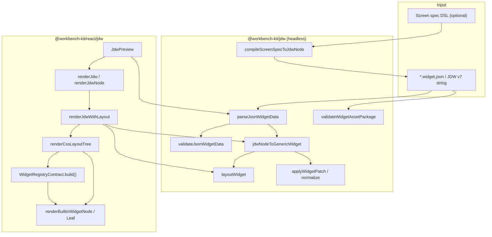
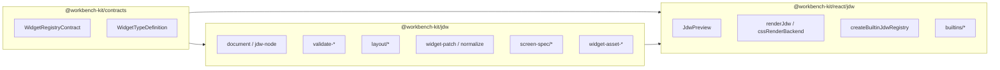
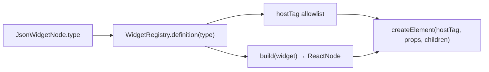

# JDW Architecture Analysis

> **Status:** Analysis (2026-06-16)  
> **Profile:** `workbench-jdw-react-v1`  
> **Scope:** `@workbench-kit/jdw` + `@workbench-kit/react/jdw`

---

## 1. Executive Summary

The workbench-kit JDW stack already implements a **self-owned, CSS-based render pipeline** for Flutter `json_dynamic_widget` v7 wire format—without importing Dart/Flutter runtime. The architecture cleanly splits **headless** concerns (`parse → validate → normalize → layout → patch`) in `@workbench-kit/jdw` from **React rendering** in `@workbench-kit/react/jdw`.

**CSS-based structure is viable** and is the current preview strategy: a headless `layoutWidget` produces a rect tree; `cssRenderBackend` maps rects to absolutely positioned DOM nodes. Registry builders handle leaf widgets (`text`, etc.).

**Custom HTML tags** should be supported **conditionally**: via registry metadata and allowlisted semantic tags—not free-form tag strings in JSON. Custom components map to registry `type` entries with vetted `build()` functions.

**Gaps vs Flutter mental model:** no unified recursive `renderJsonWidget`; dual render paths; `${variable}` / `listen` deferred; partial alignment/flex parity; `stack` layout exists but no builtin registry entry.

---

## 2. Current JDW Architecture

### Pipeline flow



### Component responsibility table

| Stage        | Module                                                      | Package                    | Role                                                   |
| ------------ | ----------------------------------------------------------- | -------------------------- | ------------------------------------------------------ |
| Parse        | `parseJsonWidgetData`, `jdwNodeToGenericWidget`             | `@workbench-kit/jdw`       | JDW v7 envelope; nested `args.children` / `args.child` |
| Validate     | `validateJsonWidgetData`                                    | `@workbench-kit/jdw`       | Per-type semantic checks; optional `strictKnownTypes`  |
| Document     | `createWidgetDocument`, `applyWidgetDocumentPatch`          | `@workbench-kit/jdw`       | Editor round-trip via `GenericWidget`                  |
| Normalize    | `normalizeWidgetSubtree`, `materializeWidgetPlacementAsset` | `@workbench-kit/jdw`       | Placement policy on insert                             |
| Layout       | `layoutWidget`, `linear/grid/stack`                         | `@workbench-kit/jdw`       | Headless rect tree                                     |
| Screen spec  | `compileScreenSpecToJdwNode`                                | `@workbench-kit/jdw`       | Alternate DSL → JDW nodes                              |
| Render entry | `renderJdw`, `JdwPreview`                                   | `@workbench-kit/react/jdw` | Parse + optional registry                              |
| CSS backend  | `renderJdwWithLayout`, `renderCssLayoutTree`                | `@workbench-kit/react/jdw` | Layout rects → absolute CSS                            |
| Registry     | `createBuiltinJdwRegistry`, `BUILTIN_JDW_REGISTRY`          | `@workbench-kit/react/jdw` | `type` → `build()` for leaves                          |
| Builtins     | `renderBuiltinWidgetNode`, `renderBuiltinWidgetLeaf`        | `@workbench-kit/react/jdw` | Flex/grid CSS fallback (registry path)                 |

---

## 3. Package / Layer Map



| Layer         | Path                                                 | Headless?  |
| ------------- | ---------------------------------------------------- | ---------- |
| Contracts     | `packages/contracts/src/widget-registry-contract.ts` | Yes        |
| Core JDW      | `packages/json-widget/src/`                          | Yes        |
| JSON Schemas  | `packages/json-widget/schemas/`                      | Yes        |
| React JDW     | `packages/react/src/jdw/`                            | No (React) |
| Editor chrome | `@workbench-kit/react/widget-tree` (`WidgetTreeLab`) | No         |

---

## 4. CSS Render Backend Deep Dive

### Two coexisting render strategies

**Strategy A — Layout backend (primary in `JdwPreview`):**

```127:134:packages/react/src/jdw/cssRenderBackend.tsx
export function renderJdwWithLayout(
  node: JsonWidgetNode,
  options: CssRenderBackendOptions = {},
): ReactNode {
  const widget = jdwNodeToGenericWidget(node);
  const tree = layoutWidget(widget, options.layoutConstraints ?? DEFAULT_LAYOUT_CONSTRAINTS);
  return renderCssLayoutTree(tree, options);
}
```

- Layout containers (`row`, `column`, `grid`, `stack`) → empty `div` shells with **absolute** child positioning from headless rects.
- Leaves → registry `build()` or `renderBuiltinWidgetLeaf` fallback.
- All host elements are hardcoded `div` / `span` with `data-widget-type` attributes.

**Strategy B — Registry recursive flex/grid (`renderBuiltinWidgetNode`):**

- Used when registry `build()` is invoked for container types.
- Uses native CSS `display: flex` / `display: grid` recursively—not layout engine rects.
- Creates a **second layout mental model** inside the same preview when registry handles containers.

### Design implication

The CSS backend achieves a **canvas-like, Flutter-layout-parity preview** (single rect tree, design-surface friendly). Registry builders remain useful for **leaf customization** and future `renderJsonWidget`-style recursion, but container types should not mix both strategies in one tree without explicit mode selection.

---

## 5. Flutter JSON Dynamic Widget Comparison

| Aspect               | Flutter `json_dynamic_widget`  | workbench-kit JDW (today)                                 |
| -------------------- | ------------------------------ | --------------------------------------------------------- |
| Wire format          | v7 `type` + `args`             | ✅ Same (`jdw-node.ts`)                                   |
| Registry             | `JsonWidgetRegistry` → builder | ✅ `WidgetRegistry` + `WidgetRegistryContract`            |
| Recursive render     | Single `build()` per node      | ⚠️ Split: layout backend + registry builtins              |
| Dynamic values       | `${var}`, `listen`             | ❌ Not implemented (Phase 4 in plan)                      |
| Layout               | Flutter render/layout          | ✅ Headless `layoutWidget` + CSS absolute                 |
| Asset packages       | plugin_components              | ✅ `manifest.json` + `content.json`                       |
| JSON Schema per type | flutter_json_schemas           | ✅ Partial (`schemas/builtins/*`, `extensions/grid.json`) |
| Kit extensions       | N/A                            | ✅ `grid` as extension type                               |
| Screen spec DSL      | N/A                            | ✅ `screen-spec/` compiles to JDW                         |
| Semantic HTML tags   | Widget-specific                | ❌ Fixed `div`/`span`                                     |

---

## 6. Feasibility: Self-Owned CSS-Based Render Structure

### Verdict: **Yes — viable and aligned with Lane B**

Evidence:

1. **Headless layout engine** is framework-neutral and tested (`layout/*.test.ts`).
2. **CSS backend** wires layout rects to DOM (`cssRenderBackend.test.tsx`).
3. **Wire format** matches JDW v7 without Flutter dependency.
4. **Profile** (`workbench-jdw-react-v1`) documents known types in `jdw-profile.ts`.

### Advantages (web)

- Single layout result tree feeds preview, future canvas overlays, and export.
- Testable without React in `@workbench-kit/jdw`.
- Design-tool preview (absolute rects) matches tile_paper/canvas direction in docs.

### Risks

| Risk              | Detail                                                                            |
| ----------------- | --------------------------------------------------------------------------------- |
| Dual render paths | Layout backend vs flex registry causes inconsistent previews                      |
| Alignment gaps    | `mainAxisAlignment` / `crossAxisAlignment` validated but `linear.ts` ignores them |
| Accessibility     | All containers as `div`; no semantic roles                                        |
| Performance       | Deep trees with absolute positioning + nested wrappers                            |
| Validation bypass | `renderJdw` calls `validateJsonWidgetData` but ignores issues for render gating   |

---

## 7. Custom Tag Configuration — Recommendation

### Verdict: **Conditional Yes**

#### Do

1. **Registry-driven host element** — extend `WidgetTypeDefinition` (contracts) with optional `hostTag?: 'div' | 'section' | 'article' | 'span' | ...` from a fixed allowlist.
2. **Custom components** — new JSON `type` values registered in host-provided registry with React `build()` only.
3. **Per-node override** — optional `args.semanticTag` only when type schema explicitly allows it and value passes allowlist validator.
4. **Asset templates** — reusable fragments stay JDW nodes; tag semantics live in registry, not raw JSON inventiveness.

#### Do not

- Accept arbitrary tag strings (`script`, `iframe`, event-handler attrs) from JSON.
- Map JSON `type` directly to DOM tag without registry (breaks sandbox).
- Use `dangerouslySetInnerHTML` for dynamic content.

#### Proposed design sketch



Example registry extension (conceptual):

```typescript
{
  type: 'section',
  hostTag: 'section',
  build: (w) => renderBuiltinWidgetNode(w),
  schema: { /* ... */ },
}
```

Aligns with existing `WidgetRegistryContract` in  
`packages/contracts/src/widget-registry-contract.ts`.

---

## 8. Risks & Non-Goals

### Risks

- Consolidating dual render paths incorrectly could break Storybook fixtures.
- Custom tags increase XSS surface if allowlist is weak.
- Lane A workbench integration may conflict with parallel Lane B editor changes.

### Non-goals (from existing plans)

- Flutter runtime import
- Full playground canvas DnD (deferred in `widget-layout-schema-plan.md` §2)
- `${variable}` / `listen` until static render is stable
- Arbitrary HTML from end-user JSON

---

## 9. Suggested Evolution Path (Lane B)

From `completion-plan.md` Lane B:

1. **Unify render mode** — pick primary: layout-backend preview OR recursive `renderJsonWidget`; document secondary as opt-in.
2. **Complete layout parity** — implement `mainAxisAlignment` / `crossAxisAlignment` / child `align` in `linear.ts`.
3. **Register `stack`** in builtin registry + schema.
4. **Introduce `renderJsonWidget`** (or rename `renderJdw`) as documented recursive builder matching Flutter `data.build()`.
5. **Optional `hostTag`** on `WidgetTypeDefinition` with validator allowlist.
6. **Wire validation into preview** — surface `validateJsonWidgetData` issues in `JdwPreview` (partial today via parse only).
7. **Phase 4** — `${var}` / `listen` after static pipeline stable.


---

## 10. References

| Resource               | Path                                                    |
| ---------------------- | ------------------------------------------------------- |
| JDW package index      | `packages/json-widget/src/index.ts`                     |
| JDW node parse/convert | `packages/json-widget/src/jdw-node.ts`                  |
| Validation             | `packages/json-widget/src/validate-json-widget-data.ts` |
| Layout engine          | `packages/json-widget/src/layout/layout-widget.ts`      |
| Widget registry        | `packages/json-widget/src/widget-registry.ts`           |
| JDW profile            | `packages/json-widget/src/jdw-profile.ts`               |
| Screen spec compile    | `packages/json-widget/src/screen-spec/compile.ts`       |
| Registry contract      | `packages/contracts/src/widget-registry-contract.ts`    |
| CSS render backend     | `packages/react/src/jdw/cssRenderBackend.tsx`           |
| Render entry           | `packages/react/src/jdw/renderJdw.tsx`                  |
| JdwPreview             | `packages/react/src/jdw/JdwPreview.tsx`                 |
| Builtin registry       | `packages/react/src/jdw/createBuiltinJdwRegistry.ts`    |
| Builtin renderers      | `packages/react/src/jdw/builtins/`                      |
| Schema plan            | `docs/workbench/widget-layout-schema-plan.md`           |
| Strengths / JDW rows   | `docs/workbench/strengths-inheritance.md`               |
| Lane B roadmap         | `docs/workbench/completion-plan.md`                     |
| JSON schemas           | `packages/json-widget/schemas/`                         |
