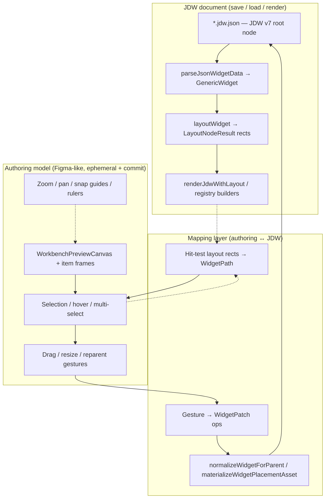

# JDW Schema + Figma-Like Authoring Split

> **Status:** Architecture note (updated 2026-06-25)
>
> **Related:** [widget-layout-schema-plan.md](./widget-layout-schema-plan.md), [strengths-inheritance.md](./strengths-inheritance.md), [json-widget-port-then-replace.md](./json-widget-port-then-replace.md), [next-slice-plan.md](./next-slice-plan.md)

## 1. Recommendation

**Conditional yes** — the split is sound and already implied by locked kit decisions:

- **Persistence + runtime display** → JDW v7 (`workbench-jdw-react-v1`) as the single on-disk contract ([widget-layout-schema-plan.md](./widget-layout-schema-plan.md) R1).
- **Authoring UX** → Figma-inspired interaction (canvas, selection chrome, drag, frames, constraints) as **editor-only state** that commits into JDW via an explicit mapping layer.

**Caveats:**

1. Do **not** introduce a second widget persistence format. `WorkbenchDocument` (absolute `x`/`y`/`width`/`height`) in `WorkbenchCanvasShell` is a separate demo schema — widget authoring must map gestures into JDW placement args (`flex`, `col`/`row`, stack insets), not parallel absolute coordinates, unless a formal adapter is defined.
2. Canvas gestures must **commit** through `@workbench-kit/jdw` patch + `normalizeWidgetForParent` — not live-mutate a shadow document that diverges from Monaco source.
3. Figma parity is **pragmatic scope** only ([strengths-inheritance.md](./strengths-inheritance.md)); zoom/pan, functional resize, marquee, rulers remain deferred.

## 2. Canonical Layers

**Single source of truth while editing** ([json-widget-port-then-replace.md](./json-widget-port-then-replace.md)): document JSON string → parse → preview; selection stays in React chrome until a patch commits.

## 3. JDW vs Authoring-Only State

| Concern                                            | Serialize to JDW?                | Where / notes                                      |
| -------------------------------------------------- | -------------------------------- | -------------------------------------------------- |
| Tree structure (`children`, `child`)               | **Yes**                          | JDW `args`                                         |
| Linear placement (`flex`, `align`)                 | **Yes**                          | Child props → `args` on save (`jdw-node.ts`)       |
| Grid placement (`col`, `row`, spans)               | **Yes**                          | Normalized on insert (`widget-normalize.ts`)       |
| Stack placement (`left`, `top`, `right`, `bottom`) | **Yes**                          | Layout engine reads from child props               |
| Parent alignment / gap / padding                   | **Yes**                          | Parent node `args`                                 |
| Z-order within stack                               | **Yes**                          | `stack` child order in `args.children`             |
| Global canvas z-index                              | **No** (unless modeled as stack) | Not in JDW profile v1                              |
| Stable node `id`                                   | **Yes** (optional)               | JDW top-level `id`                                 |
| Selection / focus path                             | **No**                           | `WidgetSelectionState` in editor (`selection.ts`)  |
| Viewport zoom / pan                                | **No**                           | Deferred per schema plan §2                        |
| Snap grid overlay / guides / rulers                | **No**                           | Visual aids only                                   |
| Hover outline / selection chrome                   | **No**                           | CSS in canvas shell                                |
| Transient drag ghost / resize preview              | **No**                           | Commit via patch on pointer-up                     |
| Undo/redo stack metadata                           | **No**                           | Host or editor session (optional host persistence) |

Placement keys are **parent-type scoped**: `stripExternalPlacement` removes incompatible keys when reparenting (`widget-normalize.ts`).

## 4. Current Kit Alignment

| Layer                                   | Status                 | Evidence                                                                                        |
| --------------------------------------- | ---------------------- | ----------------------------------------------------------------------------------------------- |
| JDW parse / patch / normalize           | **Adopted**            | `@workbench-kit/jdw` (`packages/json-widget`)                                                   |
| Headless layout (row/column/grid/stack) | **Adopted**            | `layoutWidget`, rect tests                                                                      |
| CSS render from layout rects            | **Adopted**            | `cssRenderBackend.tsx` → `renderJdwWithLayout`                                                  |
| Headless mapping layer                  | **Adopted (base)**     | `layout-mapping.ts` hit-test + stack/grid drag patch tests                                      |
| Tree + inspector + Monaco + preview     | **Adopted**            | `WidgetTreeLab.tsx`                                                                             |
| Grid/flex placement in inspector        | **Partial**            | `WidgetInspectorPanel` placement sections                                                       |
| Asset insert + materialize              | **Adopted**            | Click insert and outline drop use `materializeWidgetPlacementAsset` in lab                      |
| Figma canvas primitives                 | **Partial (lab)**      | `WorkbenchCanvas.tsx` primitives are consumed by `WidgetTreeCanvasPreview`                      |
| Canvas drag / resize → JDW              | **Partial**            | Selected stack/grid drag and stack 8-way resize commit JDW patches; reparent/grid reflow remain |
| Tree ↔ canvas selection sync            | **Partial**            | Outline selection drives selected canvas frame; broader focus/hover polish remains              |
| Preview zoom / pan                      | **Removed / deferred** | next-slice-plan code truth                                                                      |

Editor chrome explicitly lagged schema/layout work ([widget-layout-schema-plan.md](./widget-layout-schema-plan.md) Phase 4).

## 5. Gaps — Figma Placement Not in JDW Export Path

1. **Canvas authoring pipeline is narrow** — `WidgetTreeCanvasPreview` wraps `JdwPreview` with selected layout frames, but reparent/asset preview drop are not implemented.
2. **React canvas gesture pipeline is partial** — selected stack/grid drag and stack 8-way resize commit JDW patches; reparent and grid reflow edge coverage remain.
3. **Functional resize is parent-scoped** — stack resize is wired through all handles; non-stack parent mappings remain future policy.
4. **Phase 4 checklist incomplete** — outline DnD, asset materialization, the B2 headless mapping base, the B3 first canvas wire-in, and stack resize are wired; reparent polish and layout-driven edge promotion remain.
5. **Parallel `WorkbenchDocument`** — Figma-like absolute layout in `packages/contracts/src/workbench-document.ts` / `WorkbenchCanvasShell` is not the JDW widget document path; using both without an adapter risks dual-model drift.
6. **JSON Schema gaps** — child placement properties not fully reflected in document schema ([widget-layout-schema-plan.md](./widget-layout-schema-plan.md) §9.1).

## 6. Custom Tags (Registry Types vs HTML)

JDW nodes use **`type` registry strings** (snake_case), not HTML element tags:

- Builtins follow JDW/Flutter naming (`row`, `column`, `text`, …).
- Kit extensions (e.g. `grid`) register via `WidgetRegistryContract` with optional JSON Schema and inspector metadata.
- Custom product types extend the registry; they serialize as JDW `type` + `args`, validated by registry-aware checks.

HTML tag names are a **render backend concern** (CSS div wrappers in `cssRenderBackend`), not the persistence contract.

## 7. Risks

| Risk                             | Mitigation                                                                                                                        |
| -------------------------------- | --------------------------------------------------------------------------------------------------------------------------------- |
| **Dual-model drift**             | One SSoT: JDW string; ban shadow trees; avoid persisting `WorkbenchDocument` for widget files without adapter                     |
| **Round-trip loss**              | All commits through `genericWidgetToJdwNode` + `normalizeWidgetForParent`; test grid/linear/stack reparent fixtures               |
| **Schema bloat**                 | Keep Figma-only fields out of JDW; extend profile deliberately (kit `grid`, not ad-hoc canvas metadata)                           |
| **Gesture vs constraint layout** | Map drag to parent-typed placement (grid slot, flex order, stack inset) — not free-form x/y unless JDW profile adds absolute mode |
| **Lane contention**              | Lane B headless first; canvas UX after Lane A unless re-prioritized ([next-slice-plan.md](./next-slice-plan.md))                  |

## 8. Suggested Phased Approach (Lane B Tie-In)

Aligned with [next-slice-plan.md](./next-slice-plan.md) Lane B (parallel, headless-first):

| Phase              | Scope                                                                                | Exit                                                      |
| ------------------ | ------------------------------------------------------------------------------------ | --------------------------------------------------------- |
| **B0 (done)**      | JDW v7 wire, parse, patch, materialize, `layoutWidget`                               | widget-layout-schema Phases 0–2                           |
| **B1**             | Schema parity for placement args; preview pipeline hardening                         | Phase 3 exit criteria                                     |
| **B2 (base done)** | **Mapping layer spec** — hit-test on layout rects; stack/grid drag → `WidgetPatch`   | `layout-mapping` headless tests                           |
| **B3**             | Wire `WorkbenchPreviewCanvas` + frames into `WidgetTreeLab`; tree ↔ canvas selection | Done first slice: selected frame + stack/grid drag commit |
| **B4**             | Drag reparent, resize, grid reflow, optional zoom/pan (Lane C overlap)               | Stack 8-way resize landed; reparent/grid reflow remain    |

**Rule:** Lane B editor/canvas expansion does not block Lane A; re-prioritize explicitly if canvas authoring becomes P0.

## References

- Missing doc: `jdw-architecture-analysis.md` was not found; this note supersedes that intent.
- Code: `packages/json-widget/src/jdw-node.ts`, `widget-normalize.ts`, `layout/`, `layout/layout-mapping.ts`, `packages/react/src/widget-tree/WidgetTreeLab.tsx`, `packages/react/src/jdw/cssRenderBackend.tsx`, `packages/react/src/layout/WorkbenchCanvas.tsx`
