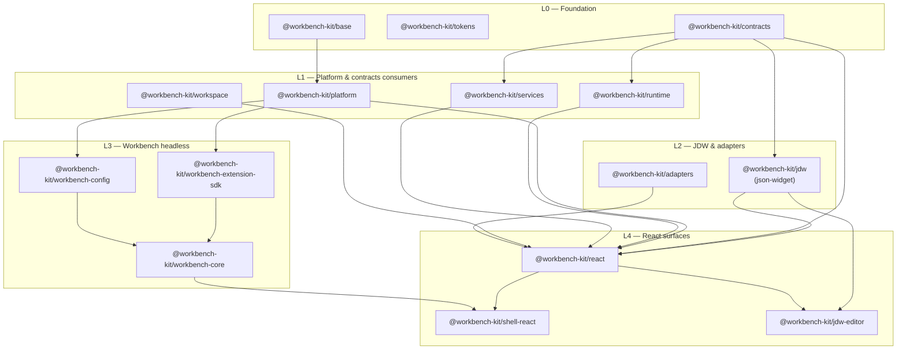
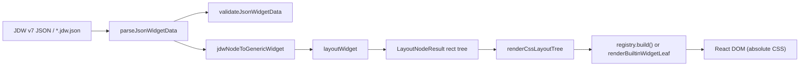
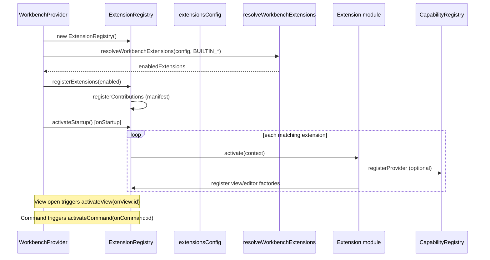

# Structural Review — Workbench Kit Monorepo

**Status:** Active analysis (updated 2026-06-20)
**Scope:** Package/layer boundaries, JDW stack, Workbench stack, workspace model, dependency-graph rules  
**Decision:** No git subtree, no separate `@workbench-kit/jdw-react` package in the current plan.

---

## 요약

- **레이어 구조는 대체로 명확함:** `base → platform → contracts → jdw → workbench-core → shell-react → react` 순으로 의존하며, `scripts/check-workbench-dependency-graph.mjs`가 금지 엣지를 CI에서 검증함.
- **JDW 이중 렌더 리스크는 2026-06-24 정리됨:** builtin registry는 `renderBuiltinWidgetLeaf`만 직접 사용하고, public `renderBuiltinWidgetNode` compatibility export는 제거됨. Preview container geometry는 `cssRenderBackend` + headless `layoutWidget`가 단일 소스.
- **이중 문서 모델:** 위젯 영속화는 JDW v7 단일 SSoT. `WorkbenchDocument`(절대 좌표 캔버스)는 `WorkbenchCanvasShell` 데모 전용이며 위젯 파일과 혼용 금지; **장기 목표는 JDW render + event layer로 통합 후 demo 경로 제거**(Lane A DoD / B2 mapping 이후).
- **Lane A 갭:** WB-29 closeout landed (reveal/focus bridge + editor↔tree sync tests); next is WB-30 preference scopes.
- **정리 우선순위 (subtree 없음):** P1 이중 렌더 통합은 완료. 다음은 preview/editor 검증면 강화와 Lane A DoD 후 legacy shim 제거. `./jdw/config` export alias는 2026-06-20 제거됨.
- **패키지 분리 제외:** React JDW는 `packages/react/src/jdw`에 유지. headless는 `@workbench-kit/jdw` (`packages/json-widget/`).

---

## 1. Review Scope & Method

This review maps **actual** `packages/` layout and import edges against
`scripts/check-workbench-dependency-graph.mjs`. Findings cite source paths verified
on branch `feature/theia-strengths-workbench` (2026-06-16).

Related plans: [session-work-plan.md](./session-work-plan.md) Track D,
[completion-plan.md](./completion-plan.md) Lane A, [jdw-architecture-analysis.md](./jdw-architecture-analysis.md).

---

## 2. Package Dependency Layers

### 2.1 Canonical layer stack

### 2.2 Enforced rules (`check-workbench-dependency-graph.mjs`)

| Package                         | Allowed `@workbench-kit/*` deps                                                          |
| ------------------------------- | ---------------------------------------------------------------------------------------- |
| `@workbench-kit/base`           | —                                                                                        |
| `@workbench-kit/platform`       | `base`                                                                                   |
| `@workbench-kit/contracts`      | —                                                                                        |
| `@workbench-kit/jdw`            | `contracts`                                                                              |
| `@workbench-kit/workbench-core` | `base`, `platform`, `workbench-config`, `workbench-extension-sdk`                        |
| `@workbench-kit/shell-react`    | `platform`, `react`, `tokens`, `workbench-config`, `workbench-core`                      |
| `@workbench-kit/react`          | `adapters`, `contracts`, `jdw`, `platform`, `runtime`, `services`, `tokens`, `workspace` |
| Extensions                      | `base`, `platform`, `react`, `workbench-extension-sdk` only                              |

**Verified:** `workbench-core` has no React imports. `shell-react` composes
`@workbench-kit/react/workbench/shell` for chrome only — it does not import `./jdw`.

### 2.3 Package map (feature-oriented)

| Layer          | Path                                | Role                                                     |
| -------------- | ----------------------------------- | -------------------------------------------------------- |
| Base           | `packages/base/`                    | `Disposable`, stores                                     |
| Platform       | `packages/platform/`                | Commands, keybindings                                    |
| Contracts      | `packages/contracts/`               | Cross-domain types (`WorkbenchDocument`, registry)       |
| JDW headless   | `packages/json-widget/`             | Parse, layout, patch, screen-spec (`@workbench-kit/jdw`) |
| Workspace      | `packages/workspace/`               | Virtual FS, resource URI, transactions                   |
| Runtime        | `packages/runtime/`                 | Contract runtime helpers                                 |
| Services       | `packages/services/`                | Service contracts                                        |
| Adapters       | `packages/adapters/`                | Demo / host adapters                                     |
| Workbench SDK  | `packages/workbench-extension-sdk/` | Extension manifest + contribution types                  |
| Workbench core | `packages/workbench-core/`          | `ExtensionRegistry`, registries, `EditorService`         |
| Shell React    | `packages/shell-react/`             | `WorkbenchProvider`, shell assembly                      |
| React kit      | `packages/react/`                   | Primitives, workbench UI, JDW render, widget-tree        |
| JDW editor     | `packages/jdw-editor/`              | Screen-spec authoring UI                                 |
| Extensions     | `extensions/*`                      | Built-in contributions                                   |
| Sample host    | `examples/workbench-sample/`        | Lane A validation harness                                |

---

## 3. JDW Stack

### 3.1 Layer responsibilities

| Surface              | Path                               | Headless? | Role                                        |
| -------------------- | ---------------------------------- | --------- | ------------------------------------------- |
| `@workbench-kit/jdw` | `packages/json-widget/src/`        | Yes       | Parse, validate, layout, patch, screen-spec |
| `react/jdw`          | `packages/react/src/jdw/`          | No        | `JdwPreview`, `renderJdw`, CSS backend      |
| `widget-tree`        | `packages/react/src/widget-tree/`  | No        | Tree/inspector lab; consumes `JdwPreview`   |
| `json-config`        | `packages/react/src/json-config/`  | Partial   | Generic JSON workbench; optional preview    |
| `jdw-editor`         | `packages/jdw-editor/`             | No        | Screen-spec → JDW compile UI                |
| `widget-asset`       | `packages/react/src/widget-asset/` | No        | Asset manifest editor                       |

### 3.2 JDW data flow (parse → layout → render)

**Primary path (Strategy A):** `renderJdwWithLayout` → headless `layoutWidget` →
`renderCssLayoutTree` with absolute child positioning.

**Strategy B removed:** `BUILTIN_JDW_REGISTRY` now points builders directly at
`renderBuiltinWidgetLeaf`; container types return `null` from the builder and are
rendered by the layout backend.

Evidence:

- `packages/react/src/jdw/cssRenderBackend.tsx` — layout containers render empty shells + absolutely positioned children; leaves call registry or `renderBuiltinWidgetLeaf`.
- `packages/react/src/jdw/createBuiltinJdwRegistry.ts` — all builtin definitions share a leaf-only builder.
- `packages/react/src/jdw/index.ts` — no public `renderBuiltinWidgetNode` export remains.

### 3.3 Finding: dual render paths (resolved)

| Aspect        | Current state                                            |
| ------------- | -------------------------------------------------------- |
| Layout source | Headless `layoutWidget` rects                            |
| Containers    | Absolute positioned shells from `cssRenderBackend`       |
| Leaves        | `registry.build()` or `renderBuiltinWidgetLeaf` fallback |
| Public API    | `renderBuiltinWidgetNode` compatibility export removed   |

**Result:** Builtin container nodes no longer have a second flex/grid render path.

**Remaining risk:** Host-provided custom registry entries can still render custom
leaf components; container-like custom types must be treated as explicit
extensions with matching layout support before being considered first-class.

---

## 4. Workbench Stack

### 4.1 Components

| Piece               | Package / path                         | Role                                               |
| ------------------- | -------------------------------------- | -------------------------------------------------- |
| Extension SDK       | `workbench-extension-sdk`              | Manifest schema, `ExtensionContext`, contributions |
| Core registries     | `workbench-core`                       | Views, commands, menus, capabilities, editor       |
| React shell         | `shell-react`                          | `WorkbenchProvider`, `WorkbenchShell`              |
| React chrome        | `@workbench-kit/react/workbench/shell` | Activity bar, sidebar, status (presentation)       |
| Sample host         | `examples/workbench-sample`            | Bundled extensions + editor/auth/workspace smoke   |
| Built-in extensions | `extensions/builtin.*`                 | Explorer, settings, workspace, accounts            |

### 4.2 Extension activation flow

**Verified paths:**

- `packages/shell-react/src/provider.tsx` — creates registry, resolves extensions, `activateStartup()` on mount.
- `packages/workbench-core/src/extension-registry.ts` — `registerContributions` at register time; lazy `activateExtension` on events.
- `packages/shell-react/src/shell.tsx` — `activateView` when sidebar container changes; view hosts via `ViewHostFactoryRegistry`.

### 4.3 Finding: EditorService and shell editor flow (WB-28)

| Component          | Status | Evidence                                        |
| ------------------ | ------ | ----------------------------------------------- |
| `EditorService`    | Done   | `packages/workbench-core/src/editor-service.ts` |
| `useEditor*` hooks | Done   | `packages/shell-react/src/use-editor.ts`        |
| Tab strip UI       | Done   | `packages/shell-react/src/editor-area.tsx`      |
| Shell wiring       | Done   | `packages/shell-react/src/shell.tsx`            |
| Sample host        | Done   | `examples/workbench-sample/src/bootstrap.ts`    |

WB-28 editor shell scope is complete: `EditorArea` consumes `EditorService`,
editor host factories create tab hosts, and the sample host exercises open/save
flows. WB-29 owns the remaining explorer selection/reveal/search closeout.

### 4.4 Finding: static capability seed vs `registerProvider`

`ExtensionRegistry` constructor accepts `capabilities` map → `createCapabilityRegistry` → `registerStatic`.

Extensions use `context.capabilities.registerProvider` for disposable providers.

Test evidence: `extension-registry.test.ts` — host seeds `workbench.auth`; extension `getCapability` resolves it.

**Risk:** Dual registration paths (host static seed vs extension `registerProvider`) can hide lifecycle ownership.

**Recommendation:** Lane A DoD 후 (Track D D3) — migrate host seeds to explicit providers; document capability ownership.

---

## 5. Workspace Model

### 5.1 Three related concepts

| Concept                 | Module                    | Role                              |
| ----------------------- | ------------------------- | --------------------------------- |
| Virtual workspace state | `virtualWorkspace.ts`     | In-memory files/folders reducer   |
| Resource transactions   | `resource-transaction.ts` | Batch mutations → reducer actions |
| Adapters                | `packages/adapters/`      | Host/demo wiring to contracts     |

`applyWorkspaceResourceTransaction` folds mutations through `virtualWorkspaceReducer` — no disk persistence in Lane A.

### 5.2 URI models (dual)

| Model                   | Package     | Scheme / use                                     |
| ----------------------- | ----------- | ------------------------------------------------ |
| `ResourceUri` (generic) | `contracts` | Cross-domain (`tilepaper-*`, etc.)               |
| `WorkspaceResourceUri`  | `workspace` | `workspace://file/...`, `workspace://folder/...` |

Lane A editor/explorer should bind **`WorkspaceResourceUri` only** for virtual workspace files.

---

## 6. Boundary Violations & Architectural Smells

Checked against `check-workbench-dependency-graph.mjs` rules and spot-read of cross-imports.

| ID  | Smell                                               | Severity | Code evidence                                                                |
| --- | --------------------------------------------------- | -------- | ---------------------------------------------------------------------------- |
| S1  | Dual JDW render strategies                          | High     | `cssRenderBackend.tsx` + `createBuiltinJdwRegistry.ts`                       |
| S2  | `WorkbenchDocument` vs JDW dual model               | High     | `contracts/workbench-document-*` vs `json-widget`; widget-tree uses JDW only |
| S3  | `./jdw/config` export name mismatch                 | Resolved | Removed from `packages/react/package.json`; use `./json-config`              |
| S4  | `renderJdw` ignores validation issues               | Medium   | `renderJdw.tsx` calls `validateJsonWidgetData` but does not gate render      |
| S5  | Editor shell integration                            | Resolved | `EditorArea`, `EditorService`, `builtin.editor`, sample open/save flow       |
| S6  | Static capability seed dual path                    | Low      | `extension-registry.ts` + `capability-registry.ts`                           |
| S7  | `jdw-editor` depends on full `@workbench-kit/react` | Low      | `jdw-editor/package.json` — pulls primitives + shell, not jdw-only           |
| S8  | `JsonWorkbenchDocument` type alias                  | Low      | `packages/react/src/workbench/schema/index.ts`                               |

**Dependency graph:** No forbidden edges found in rule set for current packages (graph check is part of `pnpm validate`).

**Positive boundaries:**

- `workbench-core` remains React-free.
- Extensions limited to `base`, `platform`, `react`, `workbench-extension-sdk`.
- Headless JDW publishable separately from React (`json-widget` builds `dist/`).

---

## 7. React Import Patterns

| Consumer      | Imports from `@workbench-kit/react`                                   | Pattern                      |
| ------------- | --------------------------------------------------------------------- | ---------------------------- |
| `shell-react` | `./workbench/shell` only                                              | Chrome delegation            |
| `jdw-editor`  | `./jdw/preview`, `./jdw/samples`, `./primitives`, `./workbench/shell` | Feature package on react kit |
| Extensions    | Primitives, workbench subsets                                         | Via allowed dep list         |
| `widget-tree` | Internal `../jdw/JdwPreview`                                          | In-package relative import   |

**Note:** Public JDW entrypoints: `./jdw`, `./jdw/preview`, and `./jdw/samples`.
JSON configuration lives under `./json-config`.

---

## 8. Recommendations (No Subtree)

### 8.1 In-repo consolidation priorities

| Priority | Item                          | Action                                             | Track / lane    |
| -------- | ----------------------------- | -------------------------------------------------- | --------------- |
| **Done** | Dual render unify             | Strategy A only; registry = leaves                 | Track D D2      |
| **P2**   | Validation gating             | Surface `validateJsonWidgetData` issues in preview | Track D D1      |
| **P3**   | `JsonWorkbenchDocument` alias | Remove or document-only                            | Track D D1      |
| **P3**   | Capability static seed        | Migrate to `registerProvider` where possible       | Track D D3      |
| **P3**   | Resource URI docs             | Enforce `WorkspaceResourceUri` in explorer/editor  | Lane A WB-28/29 |

### 8.2 Keep as-is

- Headless `@workbench-kit/jdw` in `packages/json-widget/` (publishable, tested without React).
- React JDW under `packages/react/src/jdw/` — **no package split**.
- `widget-tree` as JDW editing lab (consumer, not duplicate of headless).
- `WorkbenchCanvasShell` / `WorkbenchDocument` for absolute-coordinate **demo only** — not widget file SSoT.
- `ExtensionRegistry` contribution registration at manifest parse time.
- Virtual workspace + transaction API for Lane A (in-memory).

### 8.3 Refactor timing

| When             | Refactor                                                   |
| ---------------- | ---------------------------------------------------------- |
| S7–S8 (parallel) | D0 inventory, D1 dead paths (validation/type aliases)      |
| Done 2026-06-24  | D2 dual render unify                                       |
| WB-29 closeout   | Explorer selection/reveal/search smoke coverage            |
| After Lane A DoD | D3 legacy shims (static capabilities, URI doc enforcement) |
| Lane C           | `WorkbenchDocument` adapter before any persistence merge   |

---

## 9. Action Items

| ID     | Area          | Issue                                       | Recommendation                                   | Phase        |
| ------ | ------------- | ------------------------------------------- | ------------------------------------------------ | ------------ |
| STR-01 | JDW render    | Dual paths: layout backend vs flex registry | Done: Strategy A; leaves-only registry           | Done         |
| STR-02 | JDW model     | `WorkbenchDocument` vs JDW drift            | JDW SSoT for widgets; demo adapter only (Lane C) | Deferred     |
| STR-03 | React exports | `./jdw/config` → `json-config` mismatch     | Done: remove alias; use `./json-config`          | Done         |
| STR-04 | JDW quality   | `renderJdw` ignores validation              | Gate or warn in `JdwPreview` (D1)                | S7–S8        |
| STR-05 | Lane A        | EditorService shell integration             | Done: `EditorArea` consumes `EditorService`      | Done         |
| STR-06 | Lane A        | Editor save transaction path                | Done: editor save uses workspace transactions    | Done         |
| STR-07 | Capabilities  | Static seed + `registerProvider` dual path  | Migrate host seeds; document ownership (D3)      | Post-DoD     |
| STR-08 | Workspace     | Generic vs `WorkspaceResourceUri`           | Explorer/editor bind workspace scheme only       | WB-28/29     |
| STR-09 | jdw-editor    | Full `react` dependency                     | Accept for now; optional slim entry later        | Low priority |
| STR-10 | Docs          | Structural truth                            | Keep this doc aligned with Track D closeout (D4) | Continuous   |

---

## 10. References

| Resource                    | Path                                                 |
| --------------------------- | ---------------------------------------------------- |
| Dependency graph checker    | `scripts/check-workbench-dependency-graph.mjs`       |
| Session plan (Track D)      | `docs/workbench/session-work-plan.md`                |
| Completion plan (Lane A)    | `docs/workbench/completion-plan.md`                  |
| JDW architecture analysis   | `docs/workbench/jdw-architecture-analysis.md`        |
| Workbench core architecture | `docs/architecture/workbench-core.md`                |
| CSS render backend          | `packages/react/src/jdw/cssRenderBackend.tsx`        |
| Builtin registry            | `packages/react/src/jdw/createBuiltinJdwRegistry.ts` |
| Extension registry          | `packages/workbench-core/src/extension-registry.ts`  |
| Editor service              | `packages/workbench-core/src/editor-service.ts`      |
| Workbench shell             | `packages/shell-react/src/shell.tsx`                 |
| Resource transactions       | `packages/workspace/src/resource-transaction.ts`     |

---

## Progress log

| Date       | Note                                                        |
| ---------- | ----------------------------------------------------------- |
| 2026-06-16 | Initial structural review; subtree/jdw-react split excluded |
