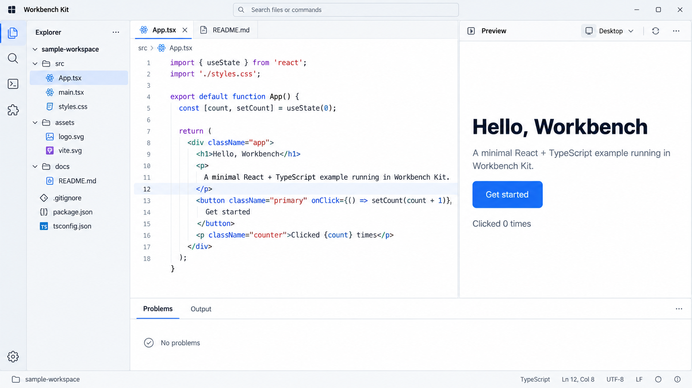

# Workbench Kit UI/UX 개선안

**상태:** 설계안 · 2026-09-25  
**기준:** 로컬 안정화 후보 `55f067d7`과 이를 합친 검증용 작업 트리의 Workbench Sample을 Chromium에서 직접 사용한 결과. 안정화 후보는 아직 `develop` 병합 또는 npm `@prototype` 배포 상태가 아니다. 이 문서는 구현·릴리스 완료를 뜻하지 않는다.

## 전면 화면 참고 시안

이 이미지는 첫 파일이 열린 Explorer·Editor·Preview·Panel의 목표 배치를 보여주는 **개념 시안**이다. Preview의 콘텐츠와 시작 파일은 Sample/host가 제공하고, Kit은 shell의 배치·상태·상호작용을 제공한다. 이미지 속 코드와 UI는 실제 구현 또는 동작 검증의 근거가 아니다.

## 가상 사용 시나리오: 작은 화면을 수정하고 다시 열기

**사용자:** 내부 도구를 만드는 개발자. **목표:** 예제 화면의 제목을 바꾸고 Preview에서 확인한 뒤, 앱을 다시 열어 작업을 이어간다. **전제:** 가상의 소비 host가 `sample-workspace`, `src/App.tsx`, 파일 저장, 실행 가능한 Preview를 제공한다. 이미지와 맞춘 설명이며 현재 Workbench Sample의 실제 시작 파일·Preview 구현을 뜻하지 않는다. 현재 Sample의 설정된 시작 경로는 JDW 예제다.

| 순간              | 사용자 행동                                                       | 화면에서 확인할 결과                                                                                                                                                                           | 책임과 검증 포인트                                                                                                 |
| ----------------- | ----------------------------------------------------------------- | ---------------------------------------------------------------------------------------------------------------------------------------------------------------------------------------------- | ------------------------------------------------------------------------------------------------------------------ |
| 1. 첫 진입        | 새 작업 공간을 연다.                                              | Explorer에는 `sample-workspace`와 관련 폴더만 보이고 `App.tsx`가 Editor에 열린다. Preview는 저장된 화면을 보여준다. 필요한 파일을 열 수 없다면 빈 Editor에 이유와 `Open file` 행동이 나타난다. | 시작 파일과 카피는 host, Explorer·Editor·Preview 배치 및 빈 상태 계약은 Kit. 열린 파일과 Explorer 선택이 일치한다. |
| 2. 수정           | Editor에서 제목 `Hello, Workbench`를 `Hello, team`으로 바꾼다.    | 활성 탭에 미저장 표시가 생긴다. Preview에는 마지막으로 **성공적으로 저장된** 화면이 남아 있어 현재 내용과의 차이가 숨겨지지 않는다.                                                            | dirty 상태와 탭 표시는 Kit, 변경 내용과 저장은 host. 입력 중 Preview 정책은 host가 명시한다.                       |
| 3. 저장·확인      | `Ctrl/Cmd+S`를 누른 뒤 Preview에서 `Get started`를 누른다.        | 저장 성공 뒤 미저장 표시가 사라지고 Preview 제목이 바뀐다. 버튼을 누르면 `Clicked 1 times`처럼 실행 결과가 보인다. Editor의 선택·스크롤은 유지된다.                                            | 저장/실행 결과는 host, 결과에 따른 shell 상태 표시는 Kit. 저장 완료 전에 성공 표시를 하지 않는다.                  |
| 4. 다른 파일 찾기 | `Ctrl/Cmd+P`로 `README.md`를 열고 다시 `App.tsx` 탭을 선택한다.   | 파일 팔레트의 모드와 결과가 분명하고, 새 탭과 Explorer의 활성 파일 표시가 함께 바뀐다. 돌아오면 커서와 스크롤 위치가 유지된다.                                                                 | 파일 검색 데이터는 host, 팔레트·탭·선택 동기화는 Kit. 키보드만으로 이동하고 Escape 뒤 이전 포커스로 돌아간다.      |
| 5. 작업 공간 조정 | 명령 팔레트(`Ctrl/Cmd+Shift+P`)에서 Preview를 숨겼다가 다시 연다. | 명령의 가용성과 실제 Panel 상태가 일치하고 Editor가 남는 너비에 맞게 재배치된다. 하단 Problems/Output은 현재 작업을 가리지 않는다.                                                             | command/context-key와 layout state는 Kit, Preview 내용은 host. 같은 명령을 다른 진입점에서 실행해도 결과가 같다.   |
| 6. 다시 시작      | 앱을 닫고 같은 작업 공간을 연다.                                  | 마지막 활성 탭, Explorer 선택, 열린 Tool Window와 Panel 상태가 가능한 범위에서 복원된다. 저장된 제목이 Preview에 보인다. 사용자가 모든 탭을 닫아둔 경우에는 빈 Editor를 그대로 복원한다.       | 복원 가능한 shell 상태는 Kit, 파일 존재·내용·지속성은 host. 저장 상태보다 강제로 시작 파일을 다시 열지 않는다.     |

**실패 분기:** 3단계에서 저장이 실패하면 탭의 미저장 표시가 남고 Preview는 마지막 저장본을 유지한다. Problems/알림은 오류와 재시도 행동을 보여준다. 6단계에서 파일이 사라졌다면 잘못된 탭이나 빈 화면 대신 `File unavailable`과 `Open another file`을 보여준다. 어느 경우에도 성공한 저장이나 복원으로 표시하지 않는다.

이 시나리오의 완료 판단은 화면을 닮게 만드는 것만으로 하지 않는다. 첫 진입·편집·저장·탐색·명령·복원·실패가 **같은 상태 모델**에서 일관되게 이어져야 한다. 실제 Workbench Sample에 적용할 때는 `App.tsx` 대신 현재 JDW 예제와 Sample이 제공하는 Preview 흐름으로 치환해 검증한다.

## 목표와 범위

첫 완료 단위는 **작업을 시작하고, 찾고, 편집하고, 실패에서 회복할 수 있는 Workbench shell**이다. Activity Bar, Tool Window, Editor, Panel, command/search, settings, 상태 복원에 집중한다. JDW, Field Remap, processing authoring은 shell 위에서 소비하는 별도 capability이며 첫 완료 단위의 탐색 구조를 결정하지 않는다.

Kit은 공통 상호작용과 상태 계약을 소유한다. Integrating host는 처음 열 콘텐츠, 제품 카피, 데이터, 저장소, 권한, 외부 실행을 소유한다. Sample은 이 경계를 검증하는 소비자이며, Sample 전용 동작을 Kit의 숨은 기본값으로 만들지 않는다.

## 현행 화면에서 확인한 문제

| 관찰                                                                                                                                                                             | 근거                                                                                                                                                                                                                    | 판단                                                                                                                                               |
| -------------------------------------------------------------------------------------------------------------------------------------------------------------------------------- | ----------------------------------------------------------------------------------------------------------------------------------------------------------------------------------------------------------------------- | -------------------------------------------------------------------------------------------------------------------------------------------------- |
| 로그인 직후 Explorer에는 여러 폴더가 펼쳐져 있고 Editor에는 `No editors open` 한 줄만 보인다. Explorer에서 파일을 고르거나 상단의 `Open example`을 눌러야 작업을 시작할 수 있다. | Workbench Sample 실제 화면, [`EditorArea`](../../packages/shell-react/src/editor/area.tsx), [`SampleTitleBarActions`](../../examples/workbench-sample/src/App.tsx)                                                      | Sample의 첫 작업 경로가 약하다. Kit의 `emptyState` 슬롯은 이미 있으므로 새 기본 랜딩 페이지보다 Sample 구성과 공통 empty-state 계약을 먼저 고친다. |
| Sample 설정의 `openPaths`와 도움말은 예제가 시작 시 열린다고 기술하지만, 검증한 브라우저 세션에서는 Editor가 비어 있었다.                                                        | [`bootstrap.ts`](../../examples/workbench-sample/src/bootstrap.ts), [`App.tsx`](../../examples/workbench-sample/src/App.tsx), 실제 첫 화면                                                                              | 복원·초기 열기 순서와 화면 카피를 일치시켜야 한다. 저장 상태가 우선인 경우에도 그 이유와 다음 행동을 보여준다.                                     |
| Search 패널에는 검색 결과가 나오고 Explorer에서 파일이 열린다. 파일 찾기(`Ctrl/Cmd+P`), 명령 실행(`Ctrl/Cmd+Shift+P`), Activity Bar의 Commands 목록도 각각 존재한다.             | 실제 Search `Button` 결과, 두 팔레트, [`command-host`](../../packages/shell-react/src/workbench/command-host.tsx), [`CommandManagementPanel`](../../packages/react/src/workbench/management/CommandManagementPanel.tsx) | 기능 추가보다 각 진입점의 역할·모드·키보드 안내를 명확히 하는 일이 우선이다. Commands 목록은 관리/탐색, 팔레트는 즉시 실행으로 둔다.               |
| Settings는 검색과 Default/Workspace/Local 범위를 제공하지만, 작은 설정 수에도 큰 대화상자를 쓰고 `3 contributions`, `effective: false`, 내부 설정 ID가 앞에 나온다.              | 실제 Settings 화면, [`settings`](../../packages/react/src/workbench/settings/)                                                                                                                                          | 공통 Settings UI의 상태 설명과 정보 밀도를 정리할 필요가 있다. 설정 스키마와 값의 소유권은 유지한다.                                               |

위 화면 관찰은 Sample의 한 데스크톱 크기와 관리자 계정에서 확인했다. 다른 host의 문제로 일반화하지 않는다. 브라우저 콘솔의 favicon 404와 CSP meta 경고는 별도 Sample 정리 항목이며 shell UX 판단의 근거로 쓰지 않는다.

## 설계 원칙

1. **첫 화면에서 다음 행동을 알 수 있어야 한다.** 빈 Editor는 상태만 말하지 않고 host가 제공한 최근 항목·파일 찾기·새 작업 중 가능한 행동을 보여준다. 행동이 없으면 설명만 표시한다.
2. **하나의 작업에는 하나의 상태와 명령 경로를 쓴다.** Activity Bar, 팔레트, Explorer, Editor의 동일 명령은 같은 command/context-key와 layout/editor state를 사용한다.
3. **선택·포커스·저장 결과를 숨기지 않는다.** 선택과 활성 Editor가 어디인지 보이고, 미저장·실패·복원 불가 상태는 실제 지속성 결과와 일치한다.
4. **정보 밀도는 작업에 맞춘다.** shell chrome은 간결하게 유지하고, 설명은 empty/error state와 Settings의 문맥에 둔다. 색상은 theme token, chrome 동작은 공통 primitive를 사용한다.
5. **키보드와 화면 읽기 흐름을 함께 설계한다.** 팔레트·트리·탭·대화상자에서 포커스 이동, 이름, 닫은 뒤 복귀 지점을 명시한다.

## 구현 순서와 수용 기준

### P0-1. 첫 작업과 복원 흐름

- **변경:** Sample의 시작 시 열기와 세션 복원 우선순위를 정한다. 열기 실패·누락 파일·빈 작업 공간은 서로 다른 메시지와 행동을 사용한다. Kit `EditorArea.emptyState`에는 host가 행동을 넣을 수 있는 현재 계약을 유지하고, 필요한 경우 공통 empty/error frame만 추출한다. Explorer는 host가 선택한 초기 펼침 상태를 존중하고, 열린 Editor의 파일만 필요할 때 드러낸다.
- **소유:** 초기 콘텐츠와 카피는 Sample/host, empty/error frame과 복원 결과 계약은 Kit.
- **수용:** 새 세션과 저장된 세션에서 첫 화면의 행동과 활성 Editor가 일치한다. 사용자가 모든 탭을 닫아 저장한 빈 Editor도 복원 상태로 존중한다. 시작 파일을 제거해도 흰 화면이나 잘못된 탭 없이 복구 행동이 보인다. 첫 화면에 작업과 무관한 트리 전체 펼침을 강제하지 않는다.

### P0-2. 탐색·명령 진입점 정리

- **변경:** `Ctrl/Cmd+P`는 파일, `Ctrl/Cmd+Shift+P`는 명령을 기본으로 하되 같은 팔레트 안에서 모드 전환을 발견할 수 있게 한다. 제목·placeholder·결과 그룹·키 안내가 현재 모드와 일치하도록 한다. Commands sidebar는 등록 명령의 관리/탐색에 집중하고 실행 가능 여부와 비활성 이유를 context key에서 받는다.
- **소유:** 팔레트와 command registry 연결은 `shell-react`/`workbench-core`; 검색 데이터와 실행 효과는 host provider.
- **수용:** 파일명 입력→열기와 명령명 입력→실행을 모두 키보드로 끝낼 수 있다. Escape 뒤 기존 포커스로 돌아온다. 같은 명령은 sidebar와 팔레트에서 가용성·실행 결과가 같다. 중복 결과와 모드 오인을 회귀 시나리오로 막는다.

### P0-3. Explorer·Editor·Panel의 작업 상태 수렴

- **변경:** Tool Window 표시/숨김, Editor 탭 활성화, Panel 전환을 command와 layout state에 맞춘다. Explorer의 선택·포커스·활성 파일 표시를 구분한다. 파일 이동/삭제/이름 변경 뒤 Editor와 트리가 같은 resource를 가리키도록 한다. 저장 실패나 미저장 탭 닫기는 지속성 결과에 따라 명확히 표시한다.
- **소유:** 상태와 명령은 `workbench-core`/`workspace`, 시각화는 `shell-react`/`react`, 실제 파일 I/O는 host.
- **수용:** 마우스와 키보드 경로가 같은 상태를 만든다. 탭·트리 이동 뒤 포커스가 사라지지 않는다. 저장 실패는 성공으로 표시되지 않고, 미저장 변경은 조용히 버려지지 않는다. 복원 후에도 pane·활성 탭·선택이 존재하는 resource와 일치한다.

### P1-1. Settings의 범위와 회복

- **변경:** Default/Workspace/Local을 값의 출처와 편집 범위로 설명한다. 설정 행에는 현재 값, 기본값/override, 재설정 행동을 우선 보여주고 내부 ID·타입·기여 extension 정보는 보조 정보로 둔다. 결과 수에 맞는 대화상자 높이와 200% zoom 스크롤을 검증한다. 저장 실패는 메모리 적용과 영구 저장 여부를 구분한다.
- **소유:** Settings UI와 상태 표시는 Kit, preference schema와 저장 adapter는 host.
- **수용:** 사용자가 값의 적용 범위와 재설정 결과를 화면에서 확인할 수 있다. 실패한 저장을 완료로 오인하지 않는다. 키보드로 검색→범위 선택→편집→재설정→닫기를 수행하며 닫힌 뒤 포커스가 복귀한다.

### P1-2. 접근성과 시각 밀도

- **변경:** Activity Bar, Explorer 트리, Editor 탭, 팔레트, Settings를 200% zoom·작은 뷰포트·reduced motion에서 검토한다. 첫 화면의 Sample 전용 파일 수/폴더 수/extension 수와 chrome 버튼은 실제 작업 판단에 필요한 순서로 배치한다.
- **수용:** 주요 작업이 수평 잘림이나 포커스 손실 없이 가능하다. 아이콘 버튼에 구체적인 접근성 이름이 있다. light/dark에서 상태·선택 대비를 theme token으로 유지한다.

## 단계별 검증

| 단계 | 확인할 사용자 흐름                                             | 게이트                                        |
| ---- | -------------------------------------------------------------- | --------------------------------------------- |
| P0-1 | 새 세션, 저장된 세션, 없는 시작 파일에서 첫 작업               | Sample 실제 브라우저 + 관련 Storybook play    |
| P0-2 | `Ctrl/Cmd+P`, `Ctrl/Cmd+Shift+P`, Search, Commands sidebar     | command/context-key 단위 테스트 + 키보드 play |
| P0-3 | Explorer 열기/이동/삭제, 탭 전환, dirty 저장·닫기, layout 복원 | 서비스 단위 테스트 + Sample 다중 화면 여정    |
| P1   | Settings 범위/재설정/쓰기 실패, 200% zoom, 포커스 복귀         | UI play + 수동 화면·키보드 확인               |

각 구현 단위는 관련 공개 API의 packed 소비 검증을 포함한다. 릴리스 후보의 정확한 tip에서 `pnpm validate`를 다시 실행하고, `develop` 병합·npm `@prototype` 확인 후에만 host가 새 API를 소비한다. 현재 로컬 후보의 통과 결과를 배포 상태로 간주하지 않는다.

## 보류할 확장

새 authoring 모드, Recipe/Mapping UI, 고급 split editor, 다중 workspace는 이 shell 흐름의 첫 완료 기준을 통과한 뒤 각 capability의 별도 입력/출력·실패 계약으로 진행한다. 이 보류는 해당 capability의 현재 코드나 검증을 삭제한다는 뜻이 아니다.
